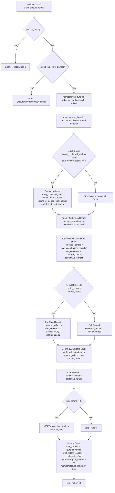

# ADR 0001: Fair Closure Algorithm

## Status
Implemented (verified in [`programs/comfi/src/pool.rs`](file:///c:/Users/sidds/Documents/comfi/programs/comfi/src/pool.rs))

## Context and Problem Statement

The ComFi protocol manages pooled native USDC capital across revolving membership cycles. In this design, members deposit recurring obligations, maintain surplus prepayments for future cycles, and authorize delegated spends for shared pool operations through governance.

A critical lifecycle event occurs when a pool dissolves or closes via a governance proposal (`ProposalAction::ClosePool`). When a pool enters closure:
1. New deposits, new withdrawal requests, and ongoing cycle spends are immediately halted.
2. The remaining USDC in the pool vault must be returned to members.

In decentralized pooled vaults, naive closure algorithms introduce severe economic attack vectors:
- **51% Cartel Majority Attack**: A colluding majority deposits capital, consumes shared funds through delegated spends, invites new honest members whose fresh deposits replenish the vault, and immediately votes to close the pool. Under a naive proportional refund based solely on historical deposits, the cartel steals the new members' deposits.
- **Bank-Run Race Conditions on Deficits**: If a pool suffers an external loss or deficit, a naive first-come-first-served (FCFS) refund allows the earliest transactions to claim 100% of their deposits, leaving late claimers with 0 USDC.
- **Expropriation of Unconsumed Surplus**: Members who prepay future cycles (surplus) should not have their unspent advance capital socialized into past-cycle deficits or shared among members who already benefited from past spends.
- **Unfunded Member Penalization**: Prospective members whose deposits have not reached the cycle obligation (`is_funded = false`) possess no governance voting power and receive no representation in pool spends; their principal must never be debited to subsidize spent funds.
- **Solana Transaction & Compute Constraints**: Iterating over an unbounded array of members during closure would fail due to transaction account limits (ALTs) and compute unit (CU) ceilings. The refund mechanism must operate in $O(1)$ compute per member claim without relying on on-chain loops.

To resolve these challenges, ComFi implements the **Fair Closure Algorithm**: a two-priority waterfall settlement engine powered by a scalable $O(1)$ cumulative spend-benefit accumulator and an atomic pro-rata deficit snapshot.

---

## Decision Drivers

1. **Anti-51% Cartel Immunity**: Members who received benefits from delegated pool spends must net out those benefits before claiming any remaining vault funds.
2. **Temporal Fairness**: Honest newcomers must never inherit liability for spends executed before their funding cycle.
3. **Surplus Isolation**: Advance prepayments for future cycles are treated as uncommitted individual capital and returned first at 100% face value.
4. **Equitable Deficit Settlement**: If the vault has insufficient funds for conferred capital, all net claimants must receive an equal pro-rata haircut rather than rewarding front-runners.
5. **$O(1)$ Lazy Evaluation**: The algorithm must execute within strict Solana compute constraints per member interaction.
6. **Graceful Fault Tolerance**: Deficits in surplus or vault balance must degrade gracefully without aborting transactions via panics.

---

## Considered Options

### Option 1: Naive Pro-Rata of Initial Deposits
- **Mechanism**: Every member receives $\text{Refund} = \text{Vault} \times \frac{\text{deposited\_total}_i}{\sum \text{deposited\_total}}$.
- **Failure Mode**: Enables the 51% cartel attack. Cartel members who already extracted value via spends still receive a pro-rata cut of new members' deposits.

### Option 2: First-Come, First-Served (FCFS) Withdrawal
- **Mechanism**: Members call withdraw until the vault is empty.
- **Failure Mode**: High MEV exposure, priority fee wars, and complete loss of principal for passive or non-bot members whenever the vault is in deficit.

### Option 3: Two-Priority Waterfall with Cumulative Benefit Accumulator & Pro-Rata Deficit Snapshot (Chosen)
- **Mechanism**:
  - Track delegated spends via a fixed-point cumulative benefit index ($O(1)$ per spend).
  - Snapshot closure basis on first claim to lock in deficit ratios.
  - Settle refunds via a two-tier waterfall: Priority 1 (Unconsumed Surplus) $\rightarrow$ Priority 2 (Net Conferred Capital with Pro-Rata Haircut).
- **Outcome**: Completely neutralizes cartel attacks, prevents bank runs, isolates surplus, protects unfunded members, and runs in $O(1)$ per claim.

---

## Detailed Technical Specification

### 1. Data Structures & State Variables

The Fair Closure Algorithm relies on coordinated fields in the [`Pool`](file:///c:/Users/sidds/Documents/comfi/programs/comfi/src/pool.rs#L465-L515) and [`Member`](file:///c:/Users/sidds/Documents/comfi/programs/comfi/src/pool.rs#L565-L586) accounts:

```rust
// Pool state fields relevant to Fair Closure
pub struct Pool {
    pub is_closing: bool,
    pub total_surplus: u64,
    pub funded_member_count: u32,
    pub cumulative_benefit_per_member: u128, // Scaled by BENEFIT_SCALE (1e12)
    pub total_conferred_capital: u64,
    pub closing_conferred_vault: u64,       // Pro-rata basis snapshot
    pub closing_conferred_pool_capital: u64, // Pro-rata basis snapshot
    pub total_settled_capital: u64,
    // ...
}

// Member state fields relevant to Fair Closure
pub struct Member {
    pub is_funded: bool,
    pub total_contributions: u64,          // Monotonic sum of all deposits ever made
    pub surplus_amount: u64,               // Current unconsumed prepaid capital
    pub surplus_cycle: u64,                // Cycle in which surplus was deposited
    pub cumulative_benefit_received: u64,  // Accrued value received from pool spends
    pub last_benefit_index: u128,          // Pool benefit index at last sync
    pub closure_claimed: bool,             // Prevents double claims
    // ...
}
```

### 2. $O(1)$ Cumulative Benefit Streaming Index

Instead of iterating over all members when a spend occurs, the pool maintains a global accumulator [`cumulative_benefit_per_member`](file:///c:/Users/sidds/Documents/comfi/programs/comfi/src/pool.rs#L510) using fixed-point precision:

$$\text{BENEFIT\_SCALE} = 10^{12} = 1{,}000{,}000{,}000{,}000$$

#### A. Spend Execution Accumulator (`spend`)
Whenever a delegated spend of amount $S$ is executed:
1. Verify active funded members: $\text{funded\_member\_count} > 0$.
2. Calculate per-member benefit increment:
   $$\Delta \text{benefit} = \frac{S \times \text{BENEFIT\_SCALE}}{\text{funded\_member\_count}}$$
3. Update global pool accumulator:
   $$\text{pool.cumulative\_benefit\_per\_member} \mathrel{+}= \Delta \text{benefit}$$
4. Reduce conferred capital:
   $$\text{pool.total\_conferred\_capital} = \text{pool.total\_conferred\_capital} \mathbin{\dot{-}} S$$

#### B. Member State Synchronization (`sync_benefit`)
When an individual member deposits, joins, or claims:
1. If $\text{pool.cumulative\_benefit\_per\_member} > \text{member.last\_benefit\_index}$:
   $$\text{diff} = \text{pool.cumulative\_benefit\_per\_member} - \text{member.last\_benefit\_index}$$
2. If `member.is_funded_for_pool()`:
   $$\text{accrued} = \left\lfloor \frac{\text{diff}}{\text{BENEFIT\_SCALE}} \right\rfloor$$
   $$\text{member.cumulative\_benefit\_received} \mathrel{+}= \text{accrued}$$
3. Update member's checkpoint:
   $$\text{member.last\_benefit\_index} = \text{pool.cumulative\_benefit\_per\_member}$$

**Key Property**: When a new member joins or becomes funded, their `last_benefit_index` is initialized to the current `pool.cumulative_benefit_per_member`. Consequently, $\text{diff} = 0$, meaning **new members never inherit liability or accrued benefit from past spends**.

#### C. Surplus Lifecycle Across Cycles (`sync_surplus`)
Surplus represents prepayment for future cycles:
- If $\text{pool.current\_cycle} > \text{member.surplus\_cycle}$:
  - The cycle has advanced, consuming the prepaid surplus into active conferred capital:
    $$\text{pool.total\_surplus} = \text{pool.total\_surplus} \mathbin{\dot{-}} \text{member.surplus\_amount}$$
    $$\text{pool.total\_conferred\_capital} = \text{pool.total\_conferred\_capital} + \text{member.surplus\_amount}$$
    $$\text{member.surplus\_amount} = 0$$
    $$\text{member.surplus\_cycle} = \text{pool.current\_cycle}$$

---

### 3. The Closure Settlement Engine (`claim_closure_refund`)

When a member invokes [`claim_closure_refund`](file:///c:/Users/sidds/Documents/comfi/programs/comfi/src/pool.rs#L1618-L1689), the program enforces a strict execution sequence:



#### Step 1: Guard Checks & State Synchronization
1. `require!(pool.is_closing, ComfiError::PoolNotClosing)`
2. `require!(!member.closure_claimed, ComfiError::ClosureRefundAlreadyClaimed)`
3. `member.sync_surplus(pool)` (advances any rolled cycle surplus transitions)
4. `member.sync_benefit(pool)` (accrues any outstanding delegated spend benefits)

#### Step 2: Atomic Pro-Rata Basis Snapshot
On the very first claim transaction after pool closure:
```rust
if pool.closing_conferred_vault == 0 && pool.total_settled_capital == 0 {
    let vault_for_conferred = ctx.accounts.vault.amount.saturating_sub(pool.total_surplus);
    pool.closing_conferred_vault = vault_for_conferred;
    pool.closing_conferred_pool_capital = pool.total_conferred_capital;
}
```
This freezes the relative deficit ratio permanently, guaranteeing that claim order cannot alter payouts.

#### Step 3: Priority 1 — Unconsumed Surplus Refund
Surplus capital was explicitly not committed to the current cycle's communal spending. It is refunded first at 100% face value:
$$\text{surplus\_refund} = \min(\text{member.surplus\_amount}, \text{vault.amount})$$
*(Note: Bounded gracefully by vault balance to avoid transaction reverts if external losses occurred).*

#### Step 4: Priority 2 — Net Conferred Capital Share
1. Compute the member's historical conferred contribution:
   $$\text{conferred\_contribution} = \text{member.total\_contributions} \mathbin{\dot{-}} \text{member.surplus\_amount}$$
2. Subtract all benefits previously extracted from the pool via spends:
   $$\text{net\_conferred\_share} = \text{conferred\_contribution} \mathbin{\dot{-}} \text{member.cumulative\_benefit\_received}$$
3. Apply the pro-rata deficit adjustment if the pool has a recorded deficit:
   $$\text{vault\_after\_surplus} = \text{vault.amount} \mathbin{\dot{-}} \text{surplus\_refund}$$
   $$\text{conferred\_refund} = \begin{cases}
   \min\left(\left\lfloor \frac{\text{net\_conferred\_share} \times \text{closing\_conferred\_vault}}{\text{closing\_conferred\_pool\_capital}} \right\rfloor, \text{vault\_after\_surplus}\right) & \text{if } \text{closing\_vault} < \text{closing\_capital} \\
   \min(\text{net\_conferred\_share}, \text{vault\_after\_surplus}) & \text{otherwise}
   \end{cases}$$

#### Step 5: Transfer & Accounting Settlement
1. Sum total refund:
   $$\text{total\_refund} = \text{surplus\_refund} + \text{conferred\_refund}$$
2. Execute CPI transfer from pool vault ATA to member's USDC token account signed by pool PDA seeds `[b"pool", &pool.id.to_le_bytes(), &[pool.bump]]`.
3. Update pool and member accounting:
   $$\text{pool.total\_surplus} = \text{pool.total\_surplus} \mathbin{\dot{-}} \text{surplus\_refund}$$
   $$\text{pool.total\_settled\_capital} = \text{pool.total\_settled\_capital} + \text{conferred\_refund}$$
   $$\text{member.surplus\_amount} = 0$$
   $$\text{member.closure_claimed} = \text{true}$$

---

## Threat Model and Attack Mitigations

### 1. The 51% Cartel Majority Attack

**Threat Scenario**:
- Cartel members $C_1$ and $C_2$ hold a voting majority.
- Each contributed 100 USDC (total 200 USDC).
- A delegated spend of 200 USDC is executed, entirely draining the vault. Both $C_1$ and $C_2$ received 100 USDC in benefit.
- An honest member $M_3$ joins the pool, depositing 50 USDC obligation + 50 USDC surplus (vault now holds 100 USDC).
- Cartel passes a `ClosePool` proposal and attempts to claim closure refunds.

**Algorithm Mitigation**:
- $C_1$ and $C_2$ benefit calculation:
  $$\text{conferred\_contrib} = 100 - 0 = 100$$
  $$\text{net\_conferred\_share} = 100 - 100 (\text{benefit}) = 0$$
  $$\text{Total Refund for } C_1 / C_2 = 0 \text{ USDC}$$
- $M_3$ calculation:
  $$\text{Priority 1 Surplus Refund} = 50 \text{ USDC}$$
  $$\text{conferred\_contrib} = 100 - 50 = 50$$
  $$\text{net\_conferred\_share} = 50 - 0 (\text{benefit}) = 50 \text{ USDC}$$
  $$\text{Total Refund for } M_3 = 50 + 50 = 100 \text{ USDC}$$
- **Result**: Cartel receives 0 USDC. $M_3$ recovers 100% of their deposited capital. The 51% attack fails completely.
- *Verified in test: [`test_anti_51_percent_attack_on_pool_closure_settlement`](file:///c:/Users/sidds/Documents/comfi/programs/comfi/src/pool.rs#L2505-L2605).*

### 2. Bank Run on Vault Deficit

**Threat Scenario**:
- Members $A$ and $B$ each have 50 USDC net conferred share (total 100 USDC).
- Due to an external incident or token discrepancy, the vault holds only 60 USDC (a 40% deficit).
- $A$ attempts to front-run $B$ to claim 50 USDC first.

**Algorithm Mitigation**:
- On initial claim, basis is snapshotted:
  $$\text{closing\_conferred\_vault} = 60, \quad \text{closing\_conferred\_pool\_capital} = 100$$
- Member $A$ claims:
  $$\text{refund}_A = \frac{50 \times 60}{100} = 30 \text{ USDC}$$
  Vault balance drops from 60 to 30.
- Member $B$ claims:
  $$\text{refund}_B = \frac{50 \times 60}{100} = 30 \text{ USDC}$$
  Vault balance drops from 30 to 0.
- **Result**: Both members receive an equal 30 USDC (50% of available funds). Front-running yields zero economic advantage.
- *Verified in test: [`test_pro_rata_settlement_on_vault_deficit`](file:///c:/Users/sidds/Documents/comfi/programs/comfi/src/pool.rs#L3104-L3183).*

### 3. Multi-Member, Multi-Cycle Timeline

**Threat Scenario**:
- Members $A$ and $B$ fund from Cycle 1 through Cycle 3, participating in Spends 1 (60 USDC) and 2 (40 USDC).
- Members $C$ and $D$ join in Cycle 3. $C$ prepays surplus.
- Spend 3 (80 USDC) occurs across all 4 funded members.
- Pool enters closure with 300 USDC in vault.

**Algorithm Mitigation**:
- Cumulative benefits accrued:
  - $A$ & $B$: $30 + 20 + 20 = 70 \text{ USDC each}$
  - $C$ & $D$: $0 + 0 + 20 = 20 \text{ USDC each}$
  - Total benefits delivered = 180 USDC (exact match to spends).
- Settlement claims:
  - $A$ (deposited 180, 30 surplus): $30 \text{ surplus} + (150 - 70) = 110 \text{ USDC}$
  - $B$ (deposited 150, 0 surplus): $0 \text{ surplus} + (150 - 70) = 80 \text{ USDC}$
  - $C$ (deposited 100, 50 surplus): $50 \text{ surplus} + (50 - 20) = 80 \text{ USDC}$
  - $D$ (deposited 50, 0 surplus): $0 \text{ surplus} + (50 - 20) = 30 \text{ USDC}$
- **Global Invariant**: $110 + 80 + 80 + 30 = 300 \text{ USDC}$. The vault is exhausted to exactly 0 with zero dust.
- *Verified in test: [`test_complex_multicycle_multimember_pool_closure_refund_settlement`](file:///c:/Users/sidds/Documents/comfi/programs/comfi/src/pool.rs#L2865-L3101).*

### 4. Unfunded Member Protection

**Threat Scenario**:
- A user deposits less than the full cycle obligation (`deposited_total < member_obligation_amount`), remaining unfunded.
- Spends take place in the pool.
- The pool closes.

**Algorithm Mitigation**:
- `sync_benefit` checks `self.is_funded_for_pool(pool)`. Because the member was unfunded, their `cumulative_benefit_received` remains 0.
- Upon closure, $\text{net\_conferred\_share} = \text{total\_contributions} - 0 = \text{total\_contributions}$.
- **Result**: The unfunded user recovers their entire unconferred deposit without dilution.
- *Verified in test: [`test_unfunded_member_refund_preserved`](file:///c:/Users/sidds/Documents/comfi/programs/comfi/src/pool.rs#L3231-L3270).*

---

## State Invariants

The Fair Closure implementation guarantees the following formal invariants:

1. **Vault Solvency & Non-Negative Balance**:
   $$\forall t, \quad \text{Vault}(t) \ge 0$$
   Total distributions during closure can never exceed the initial vault balance at closure initiation.

2. **Full Liquidation Invariant (Solvent Pool)**:
   If $\text{closing\_conferred\_vault} \ge \text{closing\_conferred\_pool\_capital}$, then upon all members claiming:
   $$\sum_{i=1}^N \text{total\_refund}_i = \text{Vault}_{\text{closure}}$$
   $$\text{Vault}_{\text{final}} = 0$$

3. **Benefit Conservation Invariant**:
   $$\sum_{i=1}^N \text{cumulative\_benefit\_received}_i = \sum_{k=1}^M \text{Spend}_k$$
   *(modulo integer division truncation scaled at $10^{-12}$).*

4. **Idempotency Invariant**:
   Calling `claim_closure_refund` more than once on the same member PDA is rejected with `ClosureRefundAlreadyClaimed`.

---

## Consequences

### Positive
- **Provable Fairness**: Guarantees that neither cartels nor early front-runners can exploit cooperative vault members.
- **Constant Gas / Compute ($O(1)$)**: Highly optimized for Solana's 200k compute unit instruction budget.
- **Clean Accounting Clean-up**: Eliminates locked token dust in standard solvent operations.

### Negative / Trade-Offs
- **Integer Truncation Dust**: Fixed-point division by `funded_member_count` can leave negligible sub-lamport remainder scaled by $10^{12}$; in practice, standard 6-decimal USDC calculations retain sub-cent accuracy.
- **Snapshot Dependency**: The deficit pro-rata ratio relies on the vault balance at the time of the *first* claim. If funds are deposited into the vault after the first claim during closure, they are not automatically reflected in `closing_conferred_vault`. (Mitigated by blocking all normal deposits once `pool.is_closing == true`).

---

## Implementation & Test Reference

| Component | File Path | Line Range |
| --- | --- | --- |
| Benefit Accumulator Constant (`BENEFIT_SCALE`) | [`pool.rs`](file:///c:/Users/sidds/Documents/comfi/programs/comfi/src/pool.rs#L463) | L463 |
| Pool Closure Fields | [`pool.rs`](file:///c:/Users/sidds/Documents/comfi/programs/comfi/src/pool.rs#L504-L514) | L504–L514 |
| Member Closure & Benefit Fields | [`pool.rs`](file:///c:/Users/sidds/Documents/comfi/programs/comfi/src/pool.rs#L578-L585) | L578–L585 |
| `sync_surplus` Implementation | [`pool.rs`](file:///c:/Users/sidds/Documents/comfi/programs/comfi/src/pool.rs#L601-L611) | L601–L611 |
| `sync_benefit` Implementation | [`pool.rs`](file:///c:/Users/sidds/Documents/comfi/programs/comfi/src/pool.rs#L613-L627) | L613–L627 |
| `spend` Accumulator Delta | [`pool.rs`](file:///c:/Users/sidds/Documents/comfi/programs/comfi/src/pool.rs#L1598-L1613) | L1598–L1613 |
| `claim_closure_refund` Instruction | [`pool.rs`](file:///c:/Users/sidds/Documents/comfi/programs/comfi/src/pool.rs#L1618-L1689) | L1618–L1689 |
| Test: Anti-51% Cartel Attack | [`pool.rs`](file:///c:/Users/sidds/Documents/comfi/programs/comfi/src/pool.rs#L2505-L2605) | L2505–L2605 |
| Test: Multi-Cycle Multi-Member Closure | [`pool.rs`](file:///c:/Users/sidds/Documents/comfi/programs/comfi/src/pool.rs#L2865-L3101) | L2865–L3101 |
| Test: Pro-Rata Deficit Settlement | [`pool.rs`](file:///c:/Users/sidds/Documents/comfi/programs/comfi/src/pool.rs#L3104-L3183) | L3104–L3183 |
| Test: Surplus Consumed Across Cycles | [`pool.rs`](file:///c:/Users/sidds/Documents/comfi/programs/comfi/src/pool.rs#L3186-L3228) | L3186–L3228 |
| Test: Unfunded Member Refund Preserved | [`pool.rs`](file:///c:/Users/sidds/Documents/comfi/programs/comfi/src/pool.rs#L3231-L3270) | L3231–L3270 |
| Test: Surplus Deficit Graceful Refund | [`pool.rs`](file:///c:/Users/sidds/Documents/comfi/programs/comfi/src/pool.rs#L3273-L3281) | L3273–L3281 |
| Test: Deposits & Joins Blocked When Closing | [`pool.rs`](file:///c:/Users/sidds/Documents/comfi/programs/comfi/src/pool.rs#L3291-L3324) | L3291–L3324 |

