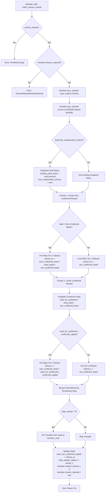

# ADR 0001: Fair Closure Algorithm

## Status
Implemented (verified in [`programs/comfi/src/pool.rs`](file:///c:/Users/sidds/Documents/comfi/programs/comfi/src/pool.rs))

## Context and Problem Statement

The ComFi protocol manages pooled native USDC capital across revolving membership cycles. In this design, members deposit recurring obligations, maintain surplus prepayments for future cycles, and authorize delegated spends for shared pool operations through governance.

A critical lifecycle event occurs when a pool dissolves or closes via a governance proposal (`ProposalAction::ClosePool`). When a pool enters closure:
1. New deposits, new withdrawal requests, and ongoing cycle spends are immediately halted.
2. The remaining USDC in the pool vault must be returned to members.

In decentralized pooled vaults, naive closure algorithms introduce severe economic attack vectors:
- **51% Cartel Majority Attack**: A colluding majority deposits capital, consumes shared funds through delegated spends, invites new honest members whose fresh deposits replenish the vault, and immediately votes to close the pool. Under a naive proportional refund based solely on historical deposits, the cartel steals the new members' deposits.
- **Bank-Run Race Conditions on Deficits**: If a pool suffers an external loss or deficit, a naive first-come-first-served (FCFS) refund allows the earliest transactions to claim 100% of their deposits, leaving late claimers with 0 USDC.
- **Expropriation of Unconsumed Surplus**: Members who prepay future cycles (surplus) should not have their unspent advance capital socialized into past-cycle deficits or shared among members who already benefited from past spends.
- **Unfunded Member Penalization**: Prospective members whose deposits have not reached the cycle obligation (`is_funded = false`) possess no governance voting power and receive no representation in pool spends; their principal must never be debited to subsidize spent funds.
- **Solana Transaction & Compute Constraints**: Iterating over an unbounded array of members during closure would fail due to transaction account limits (ALTs) and compute unit (CU) ceilings. The refund mechanism must operate in $O(1)$ compute per member claim without relying on on-chain loops.

To resolve these challenges, ComFi implements the **Fair Closure Algorithm**: a two-priority waterfall settlement engine powered by a scalable $O(1)$ cumulative spend-benefit accumulator and an atomic pro-rata deficit snapshot.

---

## Decision Drivers

1. **Anti-51% Cartel Immunity**: Members who received benefits from delegated pool spends must net out those benefits before claiming any remaining vault funds.
2. **Temporal Fairness**: Honest newcomers must never inherit liability for spends executed before their funding cycle.
3. **Surplus Isolation**: Advance prepayments for future cycles are treated as uncommitted individual capital and returned first at 100% face value.
4. **Equitable Deficit Settlement**: If the vault has insufficient funds for conferred capital, all net claimants must receive an equal pro-rata haircut rather than rewarding front-runners.
5. **$O(1)$ Lazy Evaluation**: The algorithm must execute within strict Solana compute constraints per member interaction.
6. **Graceful Fault Tolerance**: Deficits in surplus or vault balance must degrade gracefully without aborting transactions via panics.

---

## Considered Options

### Option 1: Naive Pro-Rata of Initial Deposits
- **Mechanism**: Every member receives $\text{Refund} = \text{Vault} \times \frac{\text{deposited\_total}_i}{\sum \text{deposited\_total}}$.
- **Failure Mode**: Enables the 51% cartel attack. Cartel members who already extracted value via spends still receive a pro-rata cut of new members' deposits.

### Option 2: First-Come, First-Served (FCFS) Withdrawal
- **Mechanism**: Members call withdraw until the vault is empty.
- **Failure Mode**: High MEV exposure, priority fee wars, and complete loss of principal for passive or non-bot members whenever the vault is in deficit.

### Option 3: Two-Priority Waterfall with Cumulative Benefit Accumulator & Pro-Rata Deficit Snapshot (Chosen)
- **Mechanism**:
  - Track delegated spends via a fixed-point cumulative benefit index ($O(1)$ per spend).
  - Snapshot closure basis on first claim to lock in deficit ratios.
  - Settle refunds via a two-tier waterfall: Priority 1 (Unconsumed Surplus) $\rightarrow$ Priority 2 (Net Conferred Capital with Pro-Rata Haircut).
- **Outcome**: Completely neutralizes cartel attacks, prevents bank runs, isolates surplus, protects unfunded members, and runs in $O(1)$ per claim.

---

## Detailed Technical Specification

#### 1. Data Structures & State Variables

The Fair Closure Algorithm relies on coordinated fields in the [`Pool`](file:///c:/Users/sidds/Documents/comfi/programs/comfi/src/pool.rs#L465-L515) and [`Member`](file:///c:/Users/sidds/Documents/comfi/programs/comfi/src/pool.rs#L565-L586) accounts:

```rust
// Pool state fields relevant to Fair Closure
pub struct Pool {
    pub is_closing: bool,
    pub total_non_conferred_capital: u64,    // Senior Tier 1: surplus prepayments & unfunded deposits
    pub funded_member_count: u32,
    pub cumulative_benefit_per_member: u128, // Scaled by BENEFIT_SCALE (1e12)
    pub total_conferred_capital: u64,        // Junior Tier 2: active obligation capital
    pub has_snapshotted_closure: bool,       // Atomic snapshot gatekeeper flag
    pub closing_vault_basis: u64,            // Total vault balance snapshot at initial closure claim
    pub closing_non_conferred_basis: u64,    // Total non-conferred basis snapshot
    pub closing_conferred_pool_capital: u64, // Total conferred pool capital snapshot
    pub total_settled_capital: u64,
    // ...
}

// Member state fields relevant to Fair Closure
pub struct Member {
    pub is_funded: bool,
    pub total_contributions: u64,          // Monotonic sum of all deposits ever made
    pub surplus_amount: u64,               // Current unconsumed prepaid capital
    pub surplus_cycle: u64,                // Cycle in which surplus was deposited
    pub cumulative_benefit_received: u64,  // Accrued value received from pool spends
    pub last_benefit_index: u128,          // Pool benefit index at last sync
    pub closure_claimed: bool,             // Prevents double claims
    // ...
}
```

### 2. $O(1)$ Cumulative Benefit Streaming Index

Instead of iterating over all members when a spend occurs, the pool maintains a global accumulator [`cumulative_benefit_per_member`](file:///c:/Users/sidds/Documents/comfi/programs/comfi/src/pool.rs#L510) using fixed-point precision:

$$\text{BENEFIT\_SCALE} = 10^{12} = 1{,}000{,}000{,}000{,}000$$

#### A. Spend Execution Accumulator (`spend`)
Whenever a delegated spend of amount $S$ is executed:
1. Verify active funded members: $\text{funded\_member\_count} > 0$.
2. Verify non-conferred capital inviolability: $\text{vault.amount} - S \ge \text{pool.total\_non\_conferred\_capital}$.
3. Verify conferred sufficiency: $S \le \text{pool.total\_conferred\_capital}$.
4. Calculate per-member benefit increment:
   $$\Delta \text{benefit} = \frac{S \times \text{BENEFIT\_SCALE}}{\text{funded\_member\_count}}$$
5. Update global pool accumulator:
   $$\text{pool.cumulative\_benefit\_per\_member} \mathrel{+}= \Delta \text{benefit}$$
6. Reduce conferred capital:
   $$\text{pool.total\_conferred\_capital} = \text{pool.total\_conferred\_capital} - S$$

#### B. Member State Synchronization (`sync_benefit`)
When an individual member deposits, joins, or claims:
1. If $\text{pool.cumulative\_benefit\_per\_member} > \text{member.last\_benefit\_index}$:
   $$\text{diff} = \text{pool.cumulative\_benefit\_per\_member} - \text{member.last\_benefit\_index}$$
2. If `member.is_funded_for_pool()`:
   $$\text{accrued} = \left\lfloor \frac{\text{diff}}{\text{BENEFIT\_SCALE}} \right\rfloor$$
   $$\text{member.cumulative\_benefit\_received} \mathrel{+}= \text{accrued}$$
3. Update member's checkpoint:
   $$\text{member.last\_benefit\_index} = \text{pool.cumulative\_benefit\_per\_member}$$

**Key Property**: When a new member joins or becomes funded, their `last_benefit_index` is initialized to the current `pool.cumulative_benefit_per_member`. Consequently, $\text{diff} = 0$, meaning **new members never inherit liability or accrued benefit from past spends**.

#### C. Surplus Lifecycle Across Cycles (`sync_surplus`)
Surplus represents prepayment for future cycles:
- If $\text{pool.current\_cycle} > \text{member.surplus\_cycle}$:
  - The cycle has advanced, consuming the prepaid surplus into active conferred capital:
    $$\text{pool.total\_non\_conferred\_capital} = \text{pool.total\_non\_conferred\_capital} \mathbin{\dot{-}} \text{member.surplus\_amount}$$
    $$\text{pool.total\_conferred\_capital} = \text{pool.total\_conferred\_capital} + \text{member.surplus\_amount}$$
    $$\text{member.surplus\_amount} = 0$$
    $$\text{member.surplus\_cycle} = \text{pool.current\_cycle}$$

---

### 3. The Closure Settlement Engine (`claim_closure_refund`)

When a member invokes [`claim_closure_refund`](file:///c:/Users/sidds/Documents/comfi/programs/comfi/src/pool.rs#L1618-L1689), the program enforces a two-tier settlement sequence:



#### Step 1: Guard Checks & State Synchronization
1. `require!(pool.is_closing, ComfiError::PoolNotClosing)`
2. `require!(!member.closure_claimed, ComfiError::ClosureRefundAlreadyClaimed)`
3. `member.sync_surplus(pool)` (surplus remains unconsumed once `pool.is_closing` is set)
4. `member.sync_benefit(pool)` (accrues any outstanding delegated spend benefits)

#### Step 2: Basis Determination at Closure & Vault Snapshot
When the pool is closed via proposal execution (`ProposalAction::ClosePool`), the conferred and non-conferred bases are decided immediately in that transaction:
```rust
pool.enter_closure();
// self.is_closing = true;
// self.closing_non_conferred_basis = self.total_non_conferred_capital;
// self.closing_conferred_pool_capital = self.total_conferred_capital;
```
If the vault account is passed during closure or on the very first claim transaction after pool closure:
```rust
if !pool.has_snapshotted_closure {
    pool.closing_vault_basis = ctx.accounts.vault.amount;
    pool.has_snapshotted_closure = true;
}
```
This freezes the relative deficit ratio permanently, guaranteeing that claim order cannot alter payouts.

#### Step 3: Priority 1 — Non-Conferred Capital Settlement (Senior Tier)
Non-conferred capital consists of unconsumed advance surplus prepayments and partial deposits from unfunded members:
$$\text{non\_conferred\_share} = \text{member.non\_conferred\_amount}()$$
If the vault cannot cover the non-conferred basis, all non-conferred holders receive an equitable pro-rata haircut:
$$\text{non\_conferred\_refund} = \begin{cases}
\min\left(\left\lfloor \frac{\text{non\_conferred\_share} \times \text{pool.closing\_vault\_basis}}{\text{pool.closing\_non\_conferred\_basis}} \right\rfloor, \text{vault.amount}\right) & \text{if } \text{closing\_vault\_basis} < \text{closing\_non\_conferred\_basis} \\
\min(\text{non\_conferred\_share}, \text{vault.amount}) & \text{otherwise}
\end{cases}$$

#### Step 4: Priority 2 — Net Conferred Capital Share (Junior Tier)
1. Compute the member's historical conferred contribution:
   $$\text{conferred\_contribution} = \text{member.conferred\_contribution}()$$
2. Subtract all benefits previously extracted from the pool via spends:
   $$\text{net\_conferred\_share} = \text{conferred\_contribution} \mathbin{\dot{-}} \text{member.cumulative\_benefit\_received}$$
3. Compute vault remaining for the conferred tier:
   $$\text{closing\_vault\_for\_conferred} = \text{pool.closing\_vault\_basis} \mathbin{\dot{-}} \text{pool.closing\_non\_conferred\_basis}$$
4. Apply the pro-rata deficit adjustment if the conferred tier has a recorded deficit:
   $$\text{vault\_after\_non\_conferred} = \text{vault.amount} \mathbin{\dot{-}} \text{non\_conferred\_refund}$$
   $$\text{conferred\_refund} = \begin{cases}
   \min\left(\left\lfloor \frac{\text{net\_conferred\_share} \times \text{closing\_vault\_for\_conferred}}{\text{pool.closing\_conferred\_pool\_capital}} \right\rfloor, \text{vault\_after\_non\_conferred}\right) & \text{if } \text{closing\_vault\_for\_conferred} < \text{closing\_conferred\_pool\_capital} \\
   \min(\text{net\_conferred\_share}, \text{vault\_after\_non\_conferred}) & \text{otherwise}
   \end{cases}$$

#### Step 5: Transfer & Accounting Settlement
1. Sum total refund:
   $$\text{total\_refund} = \text{non\_conferred\_refund} + \text{conferred\_refund}$$
2. Execute CPI transfer from pool vault ATA to member's USDC token account signed by pool PDA seeds `[b"pool", &pool.id.to_le_bytes(), &[pool.bump]]`.
3. Update pool and member accounting:
   $$\text{pool.total\_non\_conferred\_capital} = \text{pool.total\_non\_conferred\_capital} \mathbin{\dot{-}} \text{non\_conferred\_refund}$$
   $$\text{pool.total\_settled\_capital} = \text{pool.total\_settled\_capital} + \text{conferred\_refund}$$
   $$\text{member.surplus_amount} = 0$$
   $$\text{member.closure_claimed} = \text{true}$$e}$$

---

## Threat Model and Attack Mitigations

### 1. The 51% Cartel Majority Attack

**Threat Scenario**:
- Cartel members $C_1$ and $C_2$ hold a voting majority.
- Each contributed 100 USDC (total 200 USDC conferred capital).
- A delegated spend of 200 USDC is executed, entirely draining the vault. Both $C_1$ and $C_2$ received 100 USDC in benefit.
- An honest member $M_3$ joins the pool, depositing 50 USDC obligation + 50 USDC surplus (vault now holds 100 USDC; 50 USDC non-conferred surplus, 50 USDC conferred).
- Cartel passes a `ClosePool` proposal and attempts to claim closure refunds.

**Algorithm Mitigation**:
- $C_1$ and $C_2$ benefit calculation:
  $$\text{conferred\_contribution} = 100 \text{ USDC}$$
  $$\text{net\_conferred\_share} = 100 - 100 (\text{benefit}) = 0$$
  $$\text{Total Refund for } C_1 / C_2 = 0 \text{ USDC}$$
- $M_3$ calculation:
  $$\text{Senior Tier 1 Refund (Surplus)} = 50 \text{ USDC}$$
  $$\text{conferred\_contribution} = 50 \text{ USDC}$$
  $$\text{net\_conferred\_share} = 50 - 0 (\text{benefit}) = 50 \text{ USDC}$$
  $$\text{Total Refund for } M_3 = 50 + 50 = 100 \text{ USDC}$$
- **Result**: Cartel receives 0 USDC. $M_3$ recovers 100% of their deposited capital. The 51% attack fails completely.

### 2. Priority 1 & 2 Bank Run on Vault Deficit

**Threat Scenario**:
- Members $A$ and $B$ each have 50 USDC net conferred share (total 100 USDC conferred capital).
- Due to an external slashing incident, bridge freeze, or vault loss, the vault holds only 60 USDC (a 40% deficit).
- $A$ attempts to front-run $B$ to claim 50 USDC first on a First-Come-First-Served basis.

**Algorithm Mitigation**:
- On initial closure claim, the atomic snapshot bases freeze:
  $$\text{closing\_vault\_basis} = 60, \quad \text{closing\_non\_conferred\_basis} = 0, \quad \text{closing\_conferred\_pool\_capital} = 100$$
- Tier 2 vault balance for conferred capital:
  $$\text{closing\_vault\_for\_conferred} = 60 \mathbin{\dot{-}} 0 = 60$$
- Member $A$ claims:
  $$\text{refund}_A = \min\left(\left\lfloor \frac{50 \times 60}{100} \right\rfloor, 60\right) = 30 \text{ USDC}$$
  Vault balance drops from 60 to 30 USDC.
- Member $B$ claims:
  $$\text{refund}_B = \min\left(\left\lfloor \frac{50 \times 60}{100} \right\rfloor, 30\right) = 30 \text{ USDC}$$
  Vault balance drops from 30 to 0 USDC.
- **Result**: Both members receive exactly 30 USDC (50% of their claimable entitlement). Front-running yields zero economic advantage.

### 3. Non-Conferred Capital Deficit Waterfall

**Threat Scenario**:
- User $X$ deposited 100 USDC but remained unfunded (`total_contributions = 100`, Senior Tier 1).
- Member $Y$ has 100 USDC in unconsumed surplus (Senior Tier 1).
- Total senior non-conferred capital $C_{\text{nc}} = 200 \text{ USDC}$.
- Member $Z$ has 100 USDC net conferred capital (Junior Tier 2).
- Catastrophic loss reduces the vault to 100 USDC ($V_0 = 100 < C_{\text{nc}}$).

**Algorithm Mitigation**:
- Senior Tier 1 deficit kicks in pro-rata:
  $$\text{refund}_X = \left\lfloor \frac{100 \times 100}{200} \right\rfloor = 50 \text{ USDC}$$
  $$\text{refund}_Y = \left\lfloor \frac{100 \times 100}{200} \right\rfloor = 50 \text{ USDC}$$
- Conferred tier residual:
  $$\text{closing\_vault\_for\_conferred} = 100 \mathbin{\dot{-}} 200 = 0$$
  $$\text{refund}_Z = 0 \text{ USDC}$$
- **Result**: Junior risk-bearing capital absorbs 100% of the loss first before senior capital is touched. Senior claimants equitably share the remaining vault pro-rata.

### 4. Post-Closure Fee Drainage Prevention

**Threat Scenario**:
- The pool passes `ClosePool` and transitions to `is_closing = true`.
- An attacker spams `run_sponsored_set_alias` to siphon vault funds as sponsored relay fees before members claim their refunds.

**Algorithm Mitigation**:
- `RunSponsoredSetAlias` checks `constraint = !pool.is_closing @ ComfiError::PoolIsClosing`.
- Transaction is rejected immediately.
- Sponsored action fees during active operations are also debited from `total_conferred_capital`, guarded against non-conferred reserve, and accounted for in `cumulative_benefit_received`.

---

## State Invariants

The Fair Closure implementation guarantees the following formal invariants:

1. **Vault Solvency & Non-Negative Balance**:
   $$\forall t, \quad \text{Vault}(t) \ge 0$$
   Total distributions during closure can never exceed the initial vault balance at closure initiation.

2. **Full Liquidation Invariant (Solvent Pool)**:
   If $\text{closing\_vault\_basis} \ge \text{closing\_non\_conferred\_basis} + \text{closing\_conferred\_pool\_capital}$, then upon all members claiming:
   $$\sum_{i=1}^N \text{total\_refund}_i = \text{Vault}_{\text{closure}}$$
   $$\text{Vault}_{\text{final}} = 0$$

3. **Senior Capital Protection Invariant**:
   $$\forall t \text{ (during active cycles)}, \quad \text{Vault}(t) \ge \text{pool.total\_non\_conferred\_capital}$$
   Neither governance spends nor sponsored fees can reduce vault balances below the aggregate non-conferred capital.

4. **Benefit Conservation Invariant**:
   $$\sum_{i=1}^N \text{cumulative\_benefit\_received}_i = \sum_{k=1}^M \text{Spend}_k + \sum_{j=1}^P \text{SponsoredFee}_j$$
   *(modulo integer division truncation scaled at $10^{-12}$).*

5. **Idempotency Invariant**:
   Calling `claim_closure_refund` more than once on the same member PDA is rejected with `ClosureRefundAlreadyClaimed`.

---

## Consequences

### Positive
- **Provable Fairness**: Two-tier capital tracking guarantees senior priority for unspent surplus and unfunded deposits, while junior risk-bearing capital absorbs operational expenditures.
- **Deficit Immunity**: Atomic snapshot bases on the first claim prevent front-running and MEV bank runs on impaired vaults across both tiers.
- **Post-Closure Sealing**: All active state mutations (`join_pool`, `deposit`, `spend`, `run_sponsored_set_alias`) are strictly disallowed once `is_closing` is set.
- **$O(1)$ Compute Efficiency**: No iterating over members; fully compliant with Solana's compute limits.

### Negative / Trade-Offs
- **Integer Truncation Dust**: Fixed-point division by `funded_member_count` can leave negligible sub-lamport remainder scaled by $10^{12}$; in practice, standard 6-decimal USDC calculations retain sub-cent accuracy.
- **Snapshot Immutability**: The deficit pro-rata ratio relies on the vault balance at the time of the *first* claim. If external funds are sent to the vault PDA after the first claim, they are not automatically reflected in the snapshotted bases.

---

## Implementation References

| Component | File Path | Line Range |
| --- | --- | --- |
| Benefit Accumulator Constant (`BENEFIT_SCALE`) | [`pool.rs`](file:///c:/Users/sidds/Documents/comfi/programs/comfi/src/pool.rs#L468) | L468 |
| Pool Struct Two-Tier & Closure Basis Fields | [`pool.rs`](file:///c:/Users/sidds/Documents/comfi/programs/comfi/src/pool.rs#L509-L521) | L509–L521 |
| Pool Closure Gatekeeper (`ensure_not_closing`) | [`pool.rs`](file:///c:/Users/sidds/Documents/comfi/programs/comfi/src/pool.rs#L531-L534) | L531–L534 |
| Member Struct Two-Tier & Benefit Fields | [`pool.rs`](file:///c:/Users/sidds/Documents/comfi/programs/comfi/src/pool.rs#L582-L597) | L582–L597 |
| Member Two-Tier Classification Helpers | [`pool.rs`](file:///c:/Users/sidds/Documents/comfi/programs/comfi/src/pool.rs#L613-L623) | L613–L623 |
| `Member::sync_surplus` Implementation | [`pool.rs`](file:///c:/Users/sidds/Documents/comfi/programs/comfi/src/pool.rs#L625-L635) | L625–L635 |
| `Member::sync_benefit` Implementation | [`pool.rs`](file:///c:/Users/sidds/Documents/comfi/programs/comfi/src/pool.rs#L637-L650) | L637–L650 |
| `JoinPool` Closure Constraint & Two-Tier Routing | [`pool.rs`](file:///c:/Users/sidds/Documents/comfi/programs/comfi/src/pool.rs#L108-L113) | L108–L113 |
| `Deposit` Closure Constraint & Two-Tier Rebalancing | [`pool.rs`](file:///c:/Users/sidds/Documents/comfi/programs/comfi/src/pool.rs#L141-L148) | L141–L148, L1022–L1045 |
| `spend` Accumulator Delta & Non-Conferred Guard | [`pool.rs`](file:///c:/Users/sidds/Documents/comfi/programs/comfi/src/pool.rs#L1610-L1663) | L1610–L1663 |
| `RunSponsoredSetAlias` Post-Closure Constraint | [`pool.rs`](file:///c:/Users/sidds/Documents/comfi/programs/comfi/src/pool.rs#L1854-L1880) | L1854–L1880 |
| `claim_closure_refund` Two-Tier Waterfall Settlement | [`pool.rs`](file:///c:/Users/sidds/Documents/comfi/programs/comfi/src/pool.rs#L1666-L1755) | L1666–L1755 |
| `create_pool` Initial Two-Tier Capital Zeroing | [`deployer.rs`](file:///c:/Users/sidds/Documents/comfi/programs/comfi/src/deployer.rs#L159-L165) | L159–L165 |

