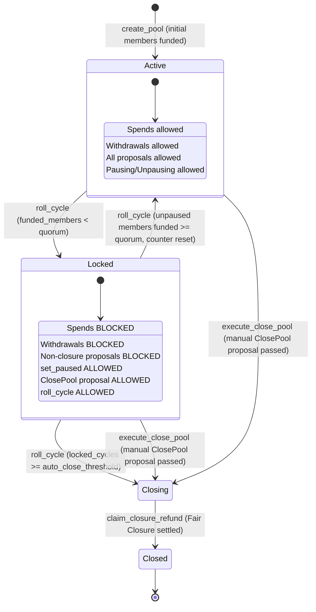

# ADR 0002: Low Quorum Pool Locking and Auto-Closure Mechanism

## Status
Proposed

## Context and Problem Statement

The ComFi protocol facilitates collaborative, revolving savings vaults on Solana. Members join pools governed by periodic funding cycles, contributing fixed recurring obligations ([`member_obligation_amount`](file:///c:/Users/sidds/Documents/comfi/programs/comfi/src/pool.rs#L488)), accumulating unconsumed surplus prepayments, and authorizing shared expenditures via on-chain governance proposals.

In an active pool, proposal approval thresholds ([`Proposal::required_votes_for_pool`](file:///c:/Users/sidds/Documents/comfi/programs/comfi/src/pool.rs#L768-L791)) are calculated dynamically based on the cohort of funded, voting participants in the current cycle:

$$\text{active\_members} = \max(\text{pool.funded\_member\_count}, 1)$$

$$\text{required\_votes} = \left\lceil \frac{\text{active\_members} \times \text{threshold\_bps}}{10{,}000} \right\rceil$$

Members can pause their participation at any time by calling [`set_paused(true)`](file:///c:/Users/sidds/Documents/comfi/programs/comfi/src/pool.rs#L1041-L1049). When a member is paused, or when their unconsumed surplus drops below the cycle obligation, their [`is_funded`](file:///c:/Users/sidds/Documents/comfi/programs/comfi/src/pool.rs#L629) status is set to `false` during the subsequent cycle rollover ([`roll_cycle`](file:///c:/Users/sidds/Documents/comfi/programs/comfi/src/pool.rs#L1323-L1377)). Consequently, [`pool.funded_member_count`](file:///c:/Users/sidds/Documents/comfi/programs/comfi/src/pool.rs#L522) declines.

### The Low Quorum & Inactivity Vulnerabilities

When participation collapses or members disengage, two severe vulnerabilities emerge:

1. **Sybil / Minority Hijacking Attack**: If 8 out of 10 members pause their participation, leaving only 2 active funded members, $\text{active\_members} = 2$. With a standard $50.01\%$ threshold, a single voter ($\lceil 2 \times 0.5001 \rceil = 2$ or 1 vote if 1 remains) holds unchecked governance power. A rogue member or colluding minority can propose and pass malicious spending limits ([`ProposalAction::SetSpenderLimit`](file:///c:/Users/sidds/Documents/comfi/programs/comfi/src/pool.rs#L585)) or emergency withdrawals ([`ProposalAction::ApproveWithdrawal`](file:///c:/Users/sidds/Documents/comfi/programs/comfi/src/pool.rs#L586)), draining collective capital without legitimate community consensus.
2. **Zombie Pool Capital Trapping (Permanent Inactivity Deadlock)**: If members abandon a pool without formally voting to dissolve it, the pool remains in a locked state indefinitely. Because inactive or departed members will not submit or vote on proposals to close the pool, honest members' capital (both unspent surplus prepayments and historical conferred contributions) can remain stranded in the vault forever.
3. **Absence of an Automated Circuit Breaker & Sunset**: Under the current protocol implementation, a pool has no automated pause state to halt spending when quorum is lost, nor an automated liquidation sunset to return trapped capital when participation fails to recover.

To address these vulnerabilities, ComFi requires an architecture for **locking a pool at low quorum** with an integrated **consecutive-cycle auto-closure mechanism**. When locked, all capital outflows and general governance modifications are suspended, allowing **only** user participation pausing/unpausing and proposals to close the pool. If participation recovers, normal operations automatically resume. If the pool remains locked across a configured number of consecutive cycles without recovery, the pool automatically transitions to closure under the Fair Closure Algorithm ([ADR 0001](file:///c:/Users/sidds/Documents/comfi/programs/comfi/adrs/0001-fair-closure-algorithm.md)), freeing all stranded capital.

---

## Decision Drivers

1. **Capital Preservation Under Quorum Failure**: Vault funds must never be spent, delegated, or extracted when active participation drops below the safe governance consensus boundary.
2. **Reversibility and Self-Healing**: Locking must not permanently brick the pool. Legitimate members must be able to restore the pool to full operational status simply by unpausing their participation and fulfilling cycle obligations.
3. **Guaranteed Capital Liberation (Zombie Pool Prevention)**: If a pool is completely abandoned or fails to recover quorum after a designated period ($N$ consecutive cycles), it must automatically dissolve, enabling members to claim their fair refunds permissionlessly without requiring governance coordination.
4. **Orderly Manual Exit Option**: Even before auto-closure triggers, members must retain the right to fast-track dissolution via pool closure proposals ([`ProposalAction::ClosePool`](file:///c:/Users/sidds/Documents/comfi/programs/comfi/src/pool.rs#L590)) settled under [ADR 0001](file:///c:/Users/sidds/Documents/comfi/programs/comfi/adrs/0001-fair-closure-algorithm.md).
5. **Strict Minimal State Surface**: In a locked state, the allowed operation set must be strictly restricted to:
   - Pausing and unpausing member participation ([`set_paused`](file:///c:/Users/sidds/Documents/comfi/programs/comfi/src/pool.rs#L1041-L1049)).
   - Creation, voting, finalization, and execution of proposals to close the pool (`ClosePool`).
   - Advancing cycle rollovers ([`roll_cycle`](file:///c:/Users/sidds/Documents/comfi/programs/comfi/src/pool.rs#L1323-L1377)) to process unpausing updates, evaluate quorum recovery, and execute auto-closure.
6. **Configurability**: Both the quorum threshold and the auto-closure cycle threshold must be configurable at pool deployment and modifiable through formal governance.
7. **Deterministic $O(1)$ Verification**: Lock checks and consecutive counter tracking must execute within strict Solana compute unit ceilings during regular cycle rollovers.

---

## Considered Options

### Option 1: Ephemeral Instruction-Time Quorum Rejection
- **Mechanism**: Every instruction that initiates a spend or proposal checks whether `pool.funded_member_count >= threshold`. No explicit state flag is stored on the [`Pool`](file:///c:/Users/sidds/Documents/comfi/programs/comfi/src/pool.rs#L480-L531) account.
- **Drawbacks**:
  - Inconsistent state representation across user interfaces and off-chain indexers.
  - Fails to block proposals that were already queued or open before participation dropped mid-cycle.
  - Fails to resolve the zombie pool problem: capital remains trapped indefinitely if no quorum ever convenes.

### Option 2: Immediate Terminal Liquidation on Single-Cycle Low Quorum
- **Mechanism**: If `funded_member_count < threshold` on any single cycle rollover, the pool immediately transitions to permanent closure (`is_closing = true`).
- **Drawbacks**:
  - Extremely brittle: Temporary seasonal lulls or accidental member pause cascades result in catastrophic, irreversible pool destruction.
  - Eliminates community recovery or self-healing opportunities.

### Option 3: Configurable Quorum Lock with Cycle-Synchronized State, Whitelist, and Consecutive-Cycle Auto-Closure (Chosen)
- **Mechanism**:
  - Configure quorum targets at creation: an absolute minimum funded member floor (`min_quorum_members`) and/or a relative participation ratio (`min_quorum_bps`).
  - Configure an auto-closure threshold (`auto_close_cycles_threshold`), designating how many consecutive locked cycles may elapse before automatic dissolution (e.g. 3 cycles; 0 disables auto-closure).
  - Track `is_locked: bool` and `locked_consecutive_cycles: u64` on [`Pool`](file:///c:/Users/sidds/Documents/comfi/programs/comfi/src/pool.rs#L480-L531).
  - During [`roll_cycle`](file:///c:/Users/sidds/Documents/comfi/programs/comfi/src/pool.rs#L1323-L1377), upon completing the member linked list:
    - If quorum is **not met**: `is_locked = true` and `locked_consecutive_cycles += 1`.
      - If `auto_close_cycles_threshold > 0` and `locked_consecutive_cycles >= auto_close_cycles_threshold`: automatically invoke [`pool.enter_closure()`](file:///c:/Users/sidds/Documents/comfi/programs/comfi/src/pool.rs#L577-L581).
    - If quorum is **met**: `is_locked = false` and `locked_consecutive_cycles = 0` (counter resets).
  - While locked, enforce strict operation whitelisting: only `set_paused`, `create_proposal(ClosePool)`, `vote(ClosePool)`, `finalize_proposal(ClosePool)`, `execute_close_pool`, `deposit`, `roll_cycle`, and `claim_closure_refund` are permitted.
- **Outcome**: Completely neutralizes low-quorum hijacking, guarantees capital safety, provides clear user ergonomics, allows graceful self-healing, and guarantees automatic liquidation if a pool is abandoned.

---

## Detailed Technical Specification

### 1. State Structures & Field Additions

#### A. Pool Account Additions

The [`Pool`](file:///c:/Users/sidds/Documents/comfi/programs/comfi/src/pool.rs#L480-L531) struct is extended with quorum configuration, lock state, and auto-closure tracking:

```rust
pub struct Pool {
    // ... existing fields ...

    /// Indicates whether the pool is locked due to low participation / sub-quorum.
    pub is_locked: bool,

    /// Minimum absolute number of funded members required for normal operations.
    /// Example: 3 members.
    pub min_quorum_members: u32,

    /// Minimum ratio of funded members to total enrolled members in basis points (1..=10,000).
    /// Example: 5000 bps (50%).
    pub min_quorum_bps: u32,

    /// Number of consecutive funding cycles the pool has spent in a locked state.
    /// Resets to 0 whenever quorum is restored.
    pub locked_consecutive_cycles: u64,

    /// Number of consecutive locked cycles before the pool automatically enters closure.
    /// Set to 0 to disable auto-closure (manual ClosePool proposal required).
    /// Example: 3 cycles.
    pub auto_close_cycles_threshold: u64,

    /// Staged configuration fields for governance updates:
    pub pending_min_quorum_members: u32,
    pub pending_min_quorum_bps: u32,
    pub pending_auto_close_cycles_threshold: u64,

    // ... remaining fields ...
}
```

#### B. Pool Creation Arguments ([`CreatePoolArgs`](file:///c:/Users/sidds/Documents/comfi/programs/comfi/src/deployer.rs#L25-L46))

```rust
pub struct CreatePoolArgs {
    // ... existing fields ...
    pub min_quorum_members: u32,
    pub min_quorum_bps: u32,
    pub auto_close_cycles_threshold: u64,
}
```

Validation constraints applied in [`validate_create_pool`](file:///c:/Users/sidds/Documents/comfi/programs/comfi/src/deployer.rs#L48-L87):
- `min_quorum_members >= 1 && min_quorum_members <= args.member_cap`
- `min_quorum_bps >= 100 && min_quorum_bps <= 10_000` (1% to 100%)
- `auto_close_cycles_threshold <= 100` (sensible upper bound on consecutive dead cycles)

#### C. Error Codes ([`ComfiError`](file:///c:/Users/sidds/Documents/comfi/programs/comfi/src/lib.rs#L136-L232))

```rust
pub enum ComfiError {
    // ... existing errors ...

    #[msg("The pool is currently locked due to low participation quorum.")]
    PoolLocked,

    #[msg("The configured quorum threshold is invalid.")]
    InvalidQuorumConfig,

    #[msg("This operation is not permitted while the pool is in a locked state.")]
    LockedOperationForbidden,
}
```

#### D. Events

```rust
#[event]
pub struct PoolLockedEvent {
    pub pool: Pubkey,
    pub cycle: u64,
    pub funded_members: u32,
    pub locked_consecutive_cycles: u64,
}

#[event]
pub struct PoolUnlockedEvent {
    pub pool: Pubkey,
    pub cycle: u64,
    pub funded_members: u32,
}

#[event]
pub struct PoolAutoClosedEvent {
    pub pool: Pubkey,
    pub cycle: u64,
    pub consecutive_locked_cycles: u64,
}
```

---

### 2. Quorum Evaluation and Auto-Closure Logic

A pool satisfies normal operational quorum if and only if both the absolute floor and relative ratio conditions are satisfied:

$$\text{is\_quorum\_met} \iff (\text{pool.funded\_member\_count} \ge \text{pool.min\_quorum\_members}) \land \left(\frac{\text{pool.funded\_member\_count} \times 10{,}000}{\max(\text{pool.member\_count}, 1)} \ge \text{pool.min\_quorum\_bps}\right)$$

In Rust implementation on [`Pool`](file:///c:/Users/sidds/Documents/comfi/programs/comfi/src/pool.rs#L480-L531):

```rust
impl Pool {
    pub fn is_quorum_satisfied(&self) -> bool {
        if self.funded_member_count < self.min_quorum_members {
            return false;
        }
        let total_members = (self.member_count as u64).max(1);
        let current_bps = (self.funded_member_count as u64)
            .saturating_mul(10_000)
            / total_members;
        current_bps >= (self.min_quorum_bps as u64)
    }

    pub fn ensure_not_locked(&self) -> Result<()> {
        require!(!self.is_locked, ComfiError::PoolLocked);
        Ok(())
    }

    pub fn evaluate_lock_and_auto_close(&mut self, pool_key: Pubkey) {
        if self.is_closing {
            self.is_locked = false;
            return;
        }

        if self.is_quorum_satisfied() {
            if self.is_locked {
                self.is_locked = false;
                emit!(PoolUnlockedEvent {
                    pool: pool_key,
                    cycle: self.current_cycle,
                    funded_members: self.funded_member_count,
                });
            }
            self.locked_consecutive_cycles = 0;
        } else {
            self.is_locked = true;
            self.locked_consecutive_cycles = self.locked_consecutive_cycles.saturating_add(1);
            emit!(PoolLockedEvent {
                pool: pool_key,
                cycle: self.current_cycle,
                funded_members: self.funded_member_count,
                locked_consecutive_cycles: self.locked_consecutive_cycles,
            });

            // Evaluate Auto-Closure trigger:
            if self.auto_close_cycles_threshold > 0
                && self.locked_consecutive_cycles >= self.auto_close_cycles_threshold
            {
                self.enter_closure();
                self.is_locked = false;
                emit!(PoolAutoClosedEvent {
                    pool: pool_key,
                    cycle: self.current_cycle,
                    consecutive_locked_cycles: self.locked_consecutive_cycles,
                });
            }
        }
    }
}
```

---

### 3. State Lifecycle & Transitions



#### Transition 1: Entering Locked State (`Active -> Locked`)
1. Members call [`set_paused(true)`](file:///c:/Users/sidds/Documents/comfi/programs/comfi/src/pool.rs#L1041-L1049) during cycle $C$.
2. Cycle $C$ finishes. [`roll_cycle`](file:///c:/Users/sidds/Documents/comfi/programs/comfi/src/pool.rs#L1323-L1377) is called to advance to $C+1$.
3. [`process_cycle_members`](file:///c:/Users/sidds/Documents/comfi/programs/comfi/src/pool.rs#L1206-L1321) iterates through the singly-linked member list. Paused members have their [`is_funded`](file:///c:/Users/sidds/Documents/comfi/programs/comfi/src/pool.rs#L629) set to `false`.
4. When `pool.rollover_cursor == None` (all members processed), the pool calls `pool.evaluate_lock_and_auto_close(pool_key)`.
5. `pool.is_locked` becomes `true`, and `pool.locked_consecutive_cycles` increments to `1`.

#### Transition 2: Autonomous Recovery (`Locked -> Active`)
1. In the locked state, members call [`set_paused(false)`](file:///c:/Users/sidds/Documents/comfi/programs/comfi/src/pool.rs#L1041-L1049) to signal willingness to participate again.
2. Members ensure their [`surplus_amount`](file:///c:/Users/sidds/Documents/comfi/programs/comfi/src/pool.rs#L637) is at least [`member_obligation_amount`](file:///c:/Users/sidds/Documents/comfi/programs/comfi/src/pool.rs#L488) (depositing via [`deposit`](file:///c:/Users/sidds/Documents/comfi/programs/comfi/src/pool.rs#L1010-L1039) if necessary).
3. At cycle expiry, [`roll_cycle`](file:///c:/Users/sidds/Documents/comfi/programs/comfi/src/pool.rs#L1323-L1377) runs.
4. [`process_cycle_members`](file:///c:/Users/sidds/Documents/comfi/programs/comfi/src/pool.rs#L1206-L1321) processes the unpaused members, deducting obligations and incrementing `funded_member_count`.
5. Upon list completion, `pool.evaluate_lock_and_auto_close(pool_key)` detects that quorum is satisfied:
   - Sets `pool.is_locked = false`.
   - Resets `pool.locked_consecutive_cycles = 0`.
   - Emits `PoolUnlockedEvent`.
6. Full operational capabilities (spends, general proposals, withdrawals) resume immediately.

#### Transition 3A: Automatic Dissolution Sunset (`Locked -> Closing via Auto-Closure`)
1. The pool remains locked for $N = \text{auto\_close\_cycles\_threshold}$ consecutive cycles without members unpausing.
2. Any crank, keeper, or member calls [`roll_cycle`](file:///c:/Users/sidds/Documents/comfi/programs/comfi/src/pool.rs#L1323-L1377) for cycle $C + N$.
3. When member rollover completes, `evaluate_lock_and_auto_close` observes `locked_consecutive_cycles >= auto_close_cycles_threshold`.
4. The program immediately executes [`pool.enter_closure()`](file:///c:/Users/sidds/Documents/comfi/programs/comfi/src/pool.rs#L577-L581):
   - Sets `pool.is_closing = true`.
   - Snapshots `closing_non_conferred_basis = pool.total_non_conferred_capital`.
   - Snapshots `closing_conferred_pool_capital = pool.total_conferred_capital`.
   - Sets `pool.is_locked = false`.
   - Emits `PoolAutoClosedEvent`.
5. Members can immediately call [`claim_closure_refund`](file:///c:/Users/sidds/Documents/comfi/programs/comfi/src/pool.rs#L1757-L1840) to recover their funds without needing to submit, vote on, or finalize any proposals.

#### Transition 3B: Manual Community Dissolution (`Locked -> Closing via Proposal`)
1. While locked, before auto-closure triggers, any eligible member submits [`create_proposal`](file:///c:/Users/sidds/Documents/comfi/programs/comfi/src/pool.rs#L1502-L1568) with `ProposalAction::ClosePool`.
2. Eligible members vote using [`vote`](file:///c:/Users/sidds/Documents/comfi/programs/comfi/src/pool.rs#L1570-L1614).
3. The proposal passes, is finalized ([`finalize_proposal`](file:///c:/Users/sidds/Documents/comfi/programs/comfi/src/pool.rs#L1616-L1658)), and executed ([`execute_close_pool`](file:///c:/Users/sidds/Documents/comfi/programs/comfi/src/pool.rs#L1732-L1755)), initiating identical Fair Closure liquidation.

---

### 4. Instruction Access Control Matrix

The table below defines the exact operational behavior for all program instructions under the `is_locked == true` state:

| Instruction | Allowed While Locked? | Enforcement Mechanism | Rationale |
|---|:---:|---|---|
| [`set_paused`](file:///c:/Users/sidds/Documents/comfi/programs/comfi/src/pool.rs#L1041) | **YES** | Unrestricted by `ensure_not_locked` | **Core Requirement**: Enables members to pause or unpause participation to coordinate quorum recovery. |
| [`create_proposal(ClosePool)`](file:///c:/Users/sidds/Documents/comfi/programs/comfi/src/pool.rs#L1502) | **YES** | Permitted via explicit action match | **Core Requirement**: Preserves the sovereign right of participants to fast-track pool dissolution. |
| [`create_proposal(Other)`](file:///c:/Users/sidds/Documents/comfi/programs/comfi/src/pool.rs#L1502) | **NO** | `require!(!pool.is_locked, ComfiError::PoolLocked)` | Prevents spend approvals, rule changes, or withdrawals under compromised consensus. |
| [`vote`](file:///c:/Users/sidds/Documents/comfi/programs/comfi/src/pool.rs#L1570) | **CONDITIONAL** | Allowed **only** if `proposal.action == ProposalAction::ClosePool` | Allows voting to pass closure proposals; disallows voting on pending non-closure actions. |
| [`finalize_proposal`](file:///c:/Users/sidds/Documents/comfi/programs/comfi/src/pool.rs#L1616) | **CONDITIONAL** | Allowed **only** for `ClosePool` proposals | Prevents finalizing non-closure proposals while locked. |
| [`execute_close_pool`](file:///c:/Users/sidds/Documents/comfi/programs/comfi/src/pool.rs#L1732) | **YES** | Explicitly permitted | Triggers pool dissolution and unlocks [ADR 0001](file:///c:/Users/sidds/Documents/comfi/programs/comfi/adrs/0001-fair-closure-algorithm.md) Fair Closure. |
| [`execute_spender_limit`](file:///c:/Users/sidds/Documents/comfi/programs/comfi/src/pool.rs#L1670) | **NO** | `pool.ensure_not_locked()?` | Blocks expanding spend limits while quorum is broken. |
| [`execute_configuration_modification`](file:///c:/Users/sidds/Documents/comfi/programs/comfi/src/pool.rs#L1693) | **NO** | `pool.ensure_not_locked()?` | Blocks modifying core protocol parameters while quorum is broken. |
| [`spend`](file:///c:/Users/sidds/Documents/comfi/programs/comfi/src/pool.rs#L1610) | **NO** | `pool.ensure_not_locked()?` | **Primary Safety Guard**: Halts all vault capital outlays to vendors and spenders. |
| [`request_withdrawal`](file:///c:/Users/sidds/Documents/comfi/programs/comfi/src/pool.rs#L1470) | **NO** | `pool.ensure_not_locked()?` | Prevents individual capital extraction; members must either restore quorum or dissolve. |
| [`deposit`](file:///c:/Users/sidds/Documents/comfi/programs/comfi/src/pool.rs#L1010) | **YES** | Permitted for existing members | Allows existing members to deposit surplus obligations required to unpause and become funded. |
| [`join_pool`](file:///c:/Users/sidds/Documents/comfi/programs/comfi/src/pool.rs#L980) | **NO** | `pool.ensure_not_locked()?` | Prevents malicious external parties from joining during a vulnerable locked phase. |
| [`run_sponsored_set_alias`](file:///c:/Users/sidds/Documents/comfi/programs/comfi/src/pool.rs#L1051) | **NO** | `pool.ensure_not_locked()?` | Prevents vault deductions for sponsored transaction fees during lock. |
| [`set_alias`](file:///c:/Users/sidds/Documents/comfi/programs/comfi/src/pool.rs#L1030) | **YES** | Permitted | Non-financial privacy rotation remains functional for active key management. |
| [`roll_cycle`](file:///c:/Users/sidds/Documents/comfi/programs/comfi/src/pool.rs#L1323) | **YES** | Explicitly permitted | **State Transition Engine**: Advances cycles, evaluates quorum recovery, and triggers auto-closure. |
| [`claim_closure_refund`](file:///c:/Users/sidds/Documents/comfi/programs/comfi/src/pool.rs#L1757) | **YES** | Governed by `pool.is_closing` | Settle two-tier waterfall refunds after closure has been triggered (manually or automatically). |

---

### 5. Governance Voting on `ClosePool` Under Low Quorum

When computing required votes for a manual `ClosePool` proposal when `funded_member_count` is critically low:

#### A. When $\text{funded\_member\_count} \ge 1$:
The proposal follows the standard strict majority rule ([`COMFI-SEC-01`](file:///c:/Users/sidds/Documents/comfi/programs/comfi/ISSUES.md#L27)):

$$\text{required\_votes} = \left\lceil \frac{\text{pool.funded\_member\_count} \times \max(\text{pool.vote\_threshold}, 5001)}{10{,}000} \right\rceil$$

Active funded members can propose and pass `ClosePool`. Because [ADR 0001](file:///c:/Users/sidds/Documents/comfi/programs/comfi/adrs/0001-fair-closure-algorithm.md) (Fair Closure Algorithm) guarantees that:
- All unspent surplus prepayments and unfunded contributions are returned 100% in Priority 1, and
- Historical spend benefits are netted out before junior conferred capital is settled in Priority 2,

A minority cannot steal other members' unspent capital by passing `ClosePool`. Every member receives their mathematically fair share.

#### B. Fallback When $\text{funded\_member\_count} == 0$:
If all members are paused or unfunded, $\text{funded\_member\_count} = 0$:
1. **Manual Fast-Track**: Any enrolled member with positive contributions ([`member.total_contributions > 0`](file:///c:/Users/sidds/Documents/comfi/programs/comfi/src/pool.rs#L642)) is permitted to propose `ClosePool`, requiring a majority of voting enrolled members to pass closure immediately.
2. **Autonomous Auto-Closure**: Even if no member submits a proposal, advancing `roll_cycle` through $N$ cycles triggers automatic closure, completely preventing capital lockup without requiring a single vote.

---

## Threat Model and Attack Mitigations

### 1. The Mass-Pause Spender Drainage Attack
- **Threat Scenario**: A colluding spender notices members pausing. The attacker waits until only 1 or 2 members remain funded, creating an artificial quorum collapse, submits a `SetSpenderLimit` proposal, votes for it with 1 vote, and drains the vault via [`spend`](file:///c:/Users/sidds/Documents/comfi/programs/comfi/src/pool.rs#L1610).
- **Mitigation**:
  - As soon as `funded_member_count < min_quorum_members` (or below `min_quorum_bps`) at rollover, `pool.is_locked` is set to `true`.
  - While `pool.is_locked == true`, [`create_proposal`](file:///c:/Users/sidds/Documents/comfi/programs/comfi/src/pool.rs#L1502) rejects any action other than `ClosePool`.
  - [`execute_spender_limit`](file:///c:/Users/sidds/Documents/comfi/programs/comfi/src/pool.rs#L1670) and [`spend`](file:///c:/Users/sidds/Documents/comfi/programs/comfi/src/pool.rs#L1610) enforce `pool.ensure_not_locked()?`, preventing any extraction of vault assets.

### 2. Spender Front-Running the Lock Transition
- **Threat Scenario**: A spender observes that the cycle has expired and members have paused. The spender rushes to call `spend` before `roll_cycle` is mined.
- **Mitigation**:
  - The protocol enforces [`pool.ensure_cycle_current()`](file:///c:/Users/sidds/Documents/comfi/programs/comfi/src/pool.rs#L569-L575) on `spend`.
  - If the cycle timestamp has expired (`now >= cycle_started_at + cycle_duration_seconds`), `spend` fails immediately with `ComfiError::CycleRollRequired`. Rollover must occur first, engaging `is_locked = true`.

### 3. Griefing Lock-Out / Hostage Taking
- **Threat Scenario**: A malicious member intentionally pauses their participation to drag `funded_member_count` below quorum, attempting to hold the pool hostage.
- **Mitigation**:
  - Honest members can unpause (`set_paused(false)`) to restore quorum.
  - If members choose not to continue, they can pass `ClosePool` or simply allow the auto-closure timer ($N$ cycles) to trigger liquidation.
  - The attacker cannot extract ransom because liquidation returns capital strictly according to net contributions via ADR 0001.

### 4. Malicious Triggering of Auto-Closure
- **Threat Scenario**: A rogue member attempts to force a pool to auto-close against the community's wishes by pausing their account.
- **Mitigation**:
  - Auto-closure requires $N \ge 1$ **consecutive** cycles in the locked state.
  - Honest members have a multi-cycle grace period to call `set_paused(false)`. As soon as quorum is restored at any cycle rollover, `locked_consecutive_cycles` immediately resets to `0`.
  - Even in the event that auto-closure executes, no capital is lost or penalized: the Fair Closure algorithm refunds unspent surplus prepayments and net conferred capital with zero economic advantage to the attacker.

---

## State Invariants

The Low Quorum Pool Locking and Auto-Closure implementation enforces the following formal invariants:

1. **Vault Outflow Invariant During Lock**:
   $$\forall t, \quad \text{pool.is\_locked}(t) \implies \left(\Delta \text{Vault}_{\text{spend}}(t) = 0 \land \Delta \text{Vault}_{\text{withdrawal}}(t) = 0 \land \Delta \text{Vault}_{\text{sponsor\_fee}}(t) = 0\right)$$
   No funds can leave the pool vault via spending, withdrawal, or relay sponsorships while `is_locked` is true.

2. **Action Whitelist Invariant**:
   $$\forall \text{ix} \in \text{Transactions}, \quad \text{pool.is\_locked} \implies \text{ix} \in \{\text{set\_paused}, \text{create\_proposal}(\text{ClosePool}), \text{vote}(\text{ClosePool}), \text{finalize\_proposal}(\text{ClosePool}), \text{execute\_close\_pool}, \text{deposit}, \text{set\_alias}, \text{roll\_cycle}, \text{claim\_closure\_refund}\}$$

3. **Deterministic Quorum Synchronization Invariant**:
   At the conclusion of any complete cycle rollover execution (where `pool.rollover_cursor == None`):
   $$\text{pool.is\_quorum\_satisfied}() \implies (\neg \text{pool.is\_locked} \land \text{pool.locked\_consecutive\_cycles} = 0)$$

4. **Auto-Closure Invariant**:
   $$\left(\text{pool.auto\_close\_cycles\_threshold} > 0 \land \text{pool.locked\_consecutive\_cycles} \ge \text{pool.auto\_close\_cycles\_threshold}\right) \implies \text{pool.is\_closing} = \text{true}$$
   The pool cannot remain active or locked beyond the configured consecutive cycle ceiling.

5. **Sovereign Unpause Invariant**:
   $$\forall m \in \text{Members}, \quad \text{pool.is\_locked} \implies \text{CanExecute}(m, \text{set\_paused})$$
   No member can ever be restricted from calling `set_paused` while the pool is locked.

6. **Terminal Closure Dominance**:
   $$\text{pool.is\_closing} \implies \neg \text{pool.is\_locked}$$
   Once a pool enters closure (`is_closing = true`), the closure lifecycle ([ADR 0001](file:///c:/Users/sidds/Documents/comfi/programs/comfi/adrs/0001-fair-closure-algorithm.md)) supersedes the lock state permanently.

---

## Consequences

### Positive
- **Guaranteed Capital Defense**: Eliminates single-voter and low-turnout governance takeovers of pool vaults.
- **Zero Zombie Capital**: Guaranteed liquidation via auto-closure eliminates stranded capital in abandoned pools without requiring manual coordination or off-chain trust.
- **Autonomous Recovery (Self-Healing)**: Members restore normal operations permissionlessly by unpausing and funding obligations; counter resets to 0 upon recovery.
- **Multi-Cycle Grace Period**: Configurable consecutive-cycle threshold gives communities ample time to rally unpauses before auto-closure activates.
- **Predictable Protocol Semantics**: Clear separation of states (`Active`, `Locked`, `Closing`) and events (`PoolLockedEvent`, `PoolUnlockedEvent`, `PoolAutoClosedEvent`).

### Negative / Trade-Offs
- **Cycle Latency for State Changes**: Quorum updates, lock toggling, and auto-closure take effect at cycle boundaries during [`roll_cycle`](file:///c:/Users/sidds/Documents/comfi/programs/comfi/src/pool.rs#L1323).
- **Auto-Closure Configuration Sensitivity**: Pools intending to pause across a long seasonal break must ensure `auto_close_cycles_threshold` is set high enough (or set to `0` to disable) so the pool does not dissolve unexpectedly.
- **Storage Overhead**: Adding `is_locked`, `min_quorum_members`, `min_quorum_bps`, `locked_consecutive_cycles`, `auto_close_cycles_threshold`, and pending fields to [`Pool`](file:///c:/Users/sidds/Documents/comfi/programs/comfi/src/pool.rs#L480) increases the pool account allocation by approximately 34 bytes, which is accounted for in [`Pool::BASE_SPACE`](file:///c:/Users/sidds/Documents/comfi/programs/comfi/src/pool.rs#L534).

---

## Implementation References

| Component | File Path | Scope / Line Reference |
|---|---|---|
| Pool Account Definition & State Flags | [`pool.rs`](file:///c:/Users/sidds/Documents/comfi/programs/comfi/src/pool.rs#L480-L531) | Add `is_locked`, `min_quorum_members`, `min_quorum_bps`, `locked_consecutive_cycles`, `auto_close_cycles_threshold` |
| Pool Helper Methods (`is_quorum_satisfied`, `ensure_not_locked`, `evaluate_lock_and_auto_close`) | [`pool.rs`](file:///c:/Users/sidds/Documents/comfi/programs/comfi/src/pool.rs#L541-L576) | Core guard, lock evaluation, and auto-closure functions |
| Quorum Check & Auto-Closure Trigger in Rollover | [`pool.rs`](file:///c:/Users/sidds/Documents/comfi/programs/comfi/src/pool.rs#L1300-L1321) | Atomic lock state and auto-close evaluation upon `rollover_cursor == None` |
| Member Unpausing Operation | [`pool.rs`](file:///c:/Users/sidds/Documents/comfi/programs/comfi/src/pool.rs#L1041-L1049) | [`set_paused`](file:///c:/Users/sidds/Documents/comfi/programs/comfi/src/pool.rs#L1041) handler permitting pause/unpause during lock |
| Proposal Creation Restrictions | [`pool.rs`](file:///c:/Users/sidds/Documents/comfi/programs/comfi/src/pool.rs#L1502-L1529) | Restrict action to `ProposalAction::ClosePool` if `pool.is_locked` |
| Proposal Voting Restrictions | [`pool.rs`](file:///c:/Users/sidds/Documents/comfi/programs/comfi/src/pool.rs#L1570-L1593) | Restrict voting to `ClosePool` proposals if `pool.is_locked` |
| Execution Guard for Spend Limits & Configs | [`pool.rs`](file:///c:/Users/sidds/Documents/comfi/programs/comfi/src/pool.rs#L1670-L1710) | Guard `execute_spender_limit` & `execute_configuration_modification` |
| Spender Withdrawal Guard | [`pool.rs`](file:///c:/Users/sidds/Documents/comfi/programs/comfi/src/pool.rs#L1610-L1630) | Guard [`spend`](file:///c:/Users/sidds/Documents/comfi/programs/comfi/src/pool.rs#L1610) with `pool.ensure_not_locked()?` |
| Pool Deployment Quorum Arguments | [`deployer.rs`](file:///c:/Users/sidds/Documents/comfi/programs/comfi/src/deployer.rs#L25-L87) | Add and validate quorum arguments and `auto_close_cycles_threshold` in [`CreatePoolArgs`](file:///c:/Users/sidds/Documents/comfi/programs/comfi/src/deployer.rs#L25) |
| Program Error Definitions | [`lib.rs`](file:///c:/Users/sidds/Documents/comfi/programs/comfi/src/lib.rs#L136-L232) | Define `PoolLocked`, `InvalidQuorumConfig`, `LockedOperationForbidden` |
| Fair Closure Algorithm ADR | [ADR 0001](file:///c:/Users/sidds/Documents/comfi/programs/comfi/adrs/0001-fair-closure-algorithm.md) | Terminal liquidation reference specification |
