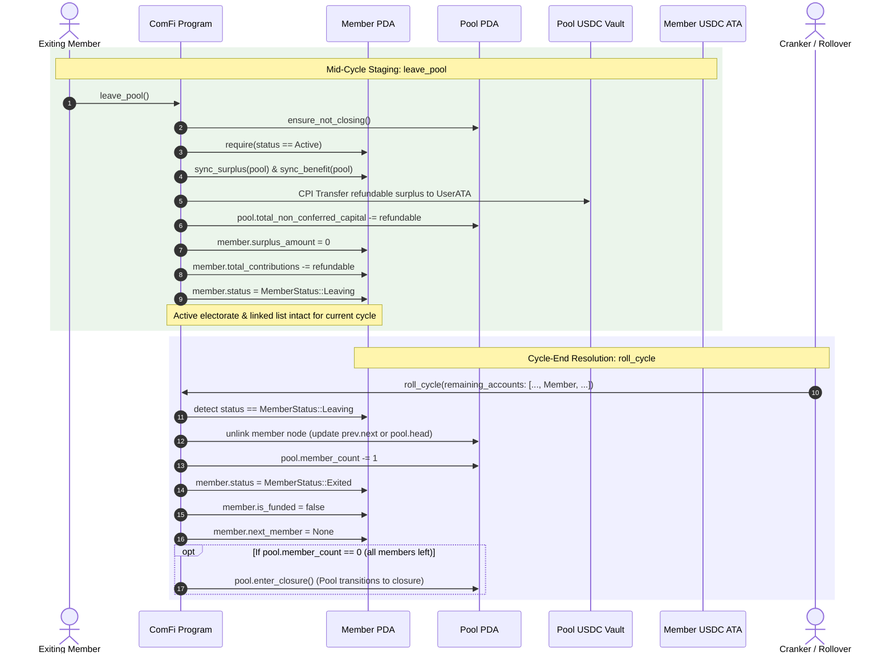
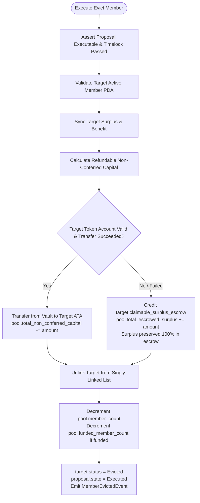

# ADR 0003: Member Voluntary Exit, Governance Eviction, and Inviolable Surplus Preservation

## Status
Implemented

## Context and Problem Statement

The ComFi protocol manages revolving, collaborative savings vaults on Solana. Members join pools governed by periodic funding cycles, contributing fixed recurring obligations ([`member_obligation_amount`](file:///c:/Users/sidds/Documents/comfi/programs/comfi/src/pool.rs#L720)), accumulating unconsumed advance prepayments ([`surplus_amount`](file:///c:/Users/sidds/Documents/comfi/programs/comfi/src/pool.rs#L940)), and authorizing shared expenditures via on-chain governance proposals.

While [ADR 0001](file:///c:/Users/sidds/Documents/comfi/programs/comfi/adrs/0001-fair-closure-algorithm.md) specifies the multi-cycle waterfall liquidation when an entire pool dissolves, and [ADR 0002](file:///c:/Users/sidds/Documents/comfi/programs/comfi/adrs/0002-low-quorum-pool-locking.md) introduces circuit breakers when quorum collapses, the protocol initially lacked mechanisms for individual member departures:

1. **No Voluntary Exit Mechanism (Capital Lock-in)**:
   A member wishing to leave an active pool previously could only call [`set_paused(true)`](file:///c:/Users/sidds/Documents/comfi/programs/comfi/src/pool.rs#L1365). Pausing halts future obligation deductions starting in the next cycle, but the member's unconsumed surplus prepayments remained permanently trapped in the pool vault as non-conferred capital until the pool as a whole dissolved. Members had no self-sovereign path to close their participation and reclaim uncommitted funds.

2. **No Involuntary Removal / Eviction Mechanism (Deadlock by Bad Actors)**:
   A pool had no ability to remove a malicious, non-cooperative, or chronically defaulting member. Such members continued to occupy an enrollment slot against [`member_cap`](file:///c:/Users/sidds/Documents/comfi/programs/comfi/src/pool.rs#L717) and remained permanent nodes in the singly-linked member list traversed during [`roll_cycle`](file:///c:/Users/sidds/Documents/comfi/programs/comfi/src/pool.rs#L1500).

3. **The Absolute Surplus Preservation Mandate**:
   In both voluntary departure and governing eviction, **a member's surplus must never be lost, forfeited, socialized, or confiscated under any circumstances**. Surplus represents uncommitted advance capital intended for future cycles. It has not yet conferred collective benefit and must remain strictly isolated and fully returned (or irrevocably claimable via escrow) in every exit path.

4. **Spender Limit Non-Interference**:
   Approved delegated spend limits and historical withdrawals reflect authorized actions agreed upon by the cohort. Outstanding spend limits or historical withdrawals must not block a member from voluntarily exiting the pool.

To address these needs, ComFi implements **voluntary member exit (`leave_pool`)**, **governing group eviction (`ProposalAction::EvictMember`)**, and **inviolable surplus preservation with fallback escrows (`claim_eviction_refund`)**.

---

## Decision Drivers

1. **Inviolable Surplus Preservation**:
   A member's unconsumed surplus prepayments (`surplus_amount`) and unfunded deposits are personal property that have never conferred collective benefit. They are never penalized, slashed, seized, or socialized under any circumstance—whether departing voluntarily or evicted by governance.
2. **Fault-Tolerant Delivery & Zero Capital Loss**:
   If an evicted member's token account is closed, uninitialized, or unable to accept SPL transfers during proposal execution, their surplus is safely preserved in an irrevocable on-chain claim escrow rather than causing execution failure or fund loss.
3. **Liquidity Protection for Active Pools**:
   Surplus (non-conferred funds) is refunded immediately. Historical conferred capital committed to active pool cycles remains preserved for settlement upon pool dissolution under [ADR 0001](file:///c:/Users/sidds/Documents/comfi/programs/comfi/adrs/0001-fair-closure-algorithm.md), protecting active pool operating liquidity.
4. **Governing Consensus & Anti-Retaliation**:
   Involuntary removal requires a strict supermajority floor of 66.67% of funded members, and the targeted member is disenfranchised from voting on their own eviction.
5. **Deterministic $O(1)$ Linked List Unlinking**:
   Unlinking a member from the pool's singly-linked list (`pool.head_member`, `member.next_member`) operates in deterministic $O(1)$ compute without unbounded traversals.
6. **No Spender Limit Lock-in**:
   Authorized spending is already settled and authorized; active spender status or prior withdrawals do not impede a member's sovereign right to exit.

---

## Technical Architecture

### 1. State Structures & Field Additions

#### Pool Extensions ([`Pool`](file:///c:/Users/sidds/Documents/comfi/programs/comfi/src/pool.rs#L710))

| Field | Type | Description |
| :--- | :--- | :--- |
| `total_escrowed_surplus` | `u64` | Total surplus held in claimable escrows awaiting member claim |
| `eviction_deadline_cycles` | `u64` | Voting duration in funding cycles for eviction proposals |
| `eviction_execution_mode` | `ExecutionMode` | `OnDeadline` or `ThresholdMet` execution trigger |
| `pending_eviction_deadline_cycles` | `u64` | Staged eviction deadline update applied on cycle roll |
| `pending_eviction_execution_mode` | `ExecutionMode` | Staged eviction execution mode update applied on cycle roll |

#### Member Extensions ([`Member`](file:///c:/Users/sidds/Documents/comfi/programs/comfi/src/pool.rs#L920))

| Field | Type | Description |
| :--- | :--- | :--- |
| `status` | `MemberStatus` | Lifecycle status: `Active`, `Leaving`, `Exited`, or `Evicted` |
| `claimable_surplus_escrow` | `u64` | Claimable surplus balance stored if immediate transfer was escrows during eviction |

#### Proposal Action Addition ([`ProposalAction`](file:///c:/Users/sidds/Documents/comfi/programs/comfi/src/pool.rs#L1150))

```rust
pub enum ProposalAction {
    SetSpenderLimit { member: Pubkey, cap: u64 },
    ApproveWithdrawal { request: Pubkey },
    ConfigurationModification { /* ... */ },
    ClosePool,
    EvictMember { member: Pubkey }, // Target member PDA
}
```

---

### 2. Voluntary Member Exit (`leave_pool`)

Voluntary exit mirrors the cycle-boundary lifecycle semantics of [`join_pool`](file:///c:/Users/sidds/Documents/comfi/programs/comfi/src/pool.rs#L1219):

- **Join pool semantics**: Invoked mid-cycle -> deposit accumulates into surplus -> `is_funded = false` (does not confer live voting rights or capital mid-cycle) -> resolved on cycle rollover (`roll_cycle`), where obligation is deducted and the member enters the active funded cohort.
- **Leave pool semantics**: Invoked mid-cycle -> uncommitted surplus (non-conferred advance capital) is immediately refunded to the member's wallet -> member transitions to `MemberStatus::Leaving` -> member remains in the linked list and live electorate for the rest of the cycle they already funded -> resolved on cycle rollover (`roll_cycle`), where the member is unlinked from the singly-linked list, `pool.member_count` is decremented, and status becomes `Exited`.



#### Key Invariants & Liquidation Equivalence:

1. **Immediate Surplus Inviolability**:
   - For funded members: `refundable = member.surplus_amount`.
   - For unfunded members (joined mid-cycle or paused): `refundable = member.non_conferred_amount()` (100% of their uncommitted deposits).
   - Advance prepayments are returned directly to the member upon invoking `leave_pool`.
2. **Cycle Stability (Denominators Preserved Mid-Cycle)**:
   - Neither `pool.funded_member_count` nor the singly-linked member chain is mutated mid-cycle. Voting thresholds, quorums, and proposal lifecycles continue uninterrupted.
3. **Deterministic Cycle-End Unlinking**:
   - During `process_cycle_members` at rollover, members with `MemberStatus::Leaving` are unlinked in-place from the singly-linked chain.
4. **Liquidation Equivalence Theorem**:
   - If every member leaves an active or locked pool, the final total refund received by each member (surplus refunded in `leave_pool` + net conferred contribution claimed via `claim_closure_refund` once `pool.member_count == 0` triggers `enter_closure`) is **mathematically identical** to what each member receives if the pool closes via `ClosePool` governance or timeout auto-closure under [ADR 0001](file:///c:/Users/sidds/Documents/comfi/programs/comfi/adrs/0001-fair-closure-algorithm.md).
5. **Exit Permitted During Circuit Breaker Locks**:
   - Members are explicitly permitted to invoke `leave_pool` when the pool is locked under [ADR 0002](file:///c:/Users/sidds/Documents/comfi/programs/comfi/adrs/0002-low-quorum-pool-locking.md). If members leave due to prolonged lockup, departure resolves at cycle roll, cleanly transitioning an abandoned pool to closure when `member_count == 0`.
6. **Spender Limit Independence**:
   - Authorized spending is finalized; prior spending or active delegated limits never block leaving.
7. **Disenfranchisement Post-Staging**:
   - A member who has staged departure (`Leaving`) or exited (`Exited`) cannot deposit, create proposals, or vote in new governance actions.

---

### 3. Governing Group Eviction (`execute_evict_member`)

When a member behaves adversely or defaults persistently, the pool's governing collective can propose and execute their eviction.

#### Governance & Voting Invariants:
1. **Supermajority Quorum Floor (66.67%)**:
   Evicting a member strips their collective rights. The threshold is bounded by a strict supermajority floor:
   $$\text{threshold\_bps} = \max(\text{pool.vote\_threshold}, 6667)$$
2. **Target Disenfranchisement**:
   The targeted member is barred from voting on the eviction proposal (`ComfiError::TargetCannotVoteOnEviction`). The effective voting electorate excludes the target:
   $$\text{active\_members} = \max(\text{pool.funded\_member\_count} - 1, 1)$$
   $$\text{required\_votes} = \left\lceil \frac{\text{active\_members} \times \text{threshold\_bps}}{10{,}000} \right\rceil$$

#### Execution & Fallback Escrow Flow:



#### Dedicated Fallback Escrow Claim (`claim_eviction_refund`):
If immediate SPL transfer could not complete during eviction (e.g. target closed their ATA or no ATA provided), the evicted member can invoke `claim_eviction_refund` at any time with a valid destination token account:
- Transfers `member.claimable_surplus_escrow` from the vault to the member's token account.
- Decrements `pool.total_escrowed_surplus` and `pool.total_non_conferred_capital`.
- Resets `member.claimable_surplus_escrow = 0`.

---

### 4. Deterministic $O(1)$ Linked List Unlinking

To maintain chunked multi-transaction cycle rollovers ([`roll_cycle`](file:///c:/Users/sidds/Documents/comfi/programs/comfi/src/pool.rs#L1500)) without unbound compute consumption, member unlinking operates deterministically:

1. **Head Member**: If `pool.head_member == Some(target_key)`, `pool.head_member` is redirected to `target.next_member`. No predecessor account is required.
2. **Interior / Tail Member**: `prev_member` must be supplied. The program verifies `prev_member.pool == pool.key()` and `prev_member.next_member == Some(target_key)`. `prev_member.next_member` is updated to `target.next_member`.
3. **Cursor Preservation**: If `pool.rollover_cursor == Some(target_key)`, the active rollover cursor advances to `target.next_member`, preventing broken iterator links during multi-stage rollovers.
4. **Target Detachment**: `target.next_member` is set to `None`.

---

## Threat Model and Attack Mitigations

| Threat Vector | Adversarial Mechanism | Protocol Mitigation |
| :--- | :--- | :--- |
| **Surplus Confiscation via Malicious Eviction** | Cartel majority votes to evict a minority member to seize their prepaid deposits. | **Surplus Inviolability**: 100% of non-conferred deposits are refunded immediately or placed in immutable escrow. Surplus can **never** be absorbed by the pool. |
| **Griefing Eviction Execution via Closed ATA** | Target closes or freezes their token account so SPL transfer reverts, aiming to brick eviction. | **Escrow Fallback**: Transfer failure routes funds into `claimable_surplus_escrow`. Eviction succeeds, and funds remain safe for the user to claim later. |
| **Eviction Retaliation / Hostile Counter-Voting** | Target votes "NO" on their own eviction to block legitimate removal. | **Target Disenfranchisement**: Target wallet and member PDA are barred from voting on eviction proposals. |
| **Predecessor Griefing in Linked List** | Adversary supplies incorrect or out-of-order predecessor node. | Strict validation requires `prev.next_member == target.key()`. Mismatched predecessor reverts with `IncompleteMemberList`. |
| **Post-Exit Zombie Operations** | Exited or evicted member attempts to vote, deposit, or request withdrawals. | All operational endpoints enforce `require!(member.status == MemberStatus::Active, MemberNotActive)`. |

---

## Invariants and Mathematical Properties

1. **Surplus Inviolability**:
   $$\forall m \in \text{Members}, \quad \text{PreservedSurplus}(m) = m.\text{non\_conferred\_amount()}$$
   Neither `leave_pool` nor `execute_evict_member` can debit surplus into collective pool capital.

2. **Non-Conferred Capital Conservation**:
   $$\text{pool.total\_non\_conferred\_capital} = \sum_{m \in \text{Active}} m.\text{non\_conferred\_amount()} + \text{pool.total\_escrowed\_surplus}$$

3. **Target Disenfranchisement**:
   $$\text{Voter}(v) \text{ on EvictMember}(T) \implies v \ne T$$

4. **Supermajority Eviction Floor**:
   $$\text{Threshold}(\text{EvictMember}) \ge 6667 \text{ bps } (66.67\%)$$

---

## Consequences

### Positive
- **Guaranteed Capital Safety**: Advance prepayments (surplus) cannot be confiscated, stolen by cartels, or absorbed into collective funds.
- **Orderly Member Pruning**: Malicious, non-cooperative, or defunct members can be pruned by supermajority consensus, freeing slots under `member_cap`.
- **Sovereign Ragequit**: Members can exit at will before adversarial proposals take effect, without being blocked by spender limits.
- **Fault-Tolerant Delivery**: Closed or uninitialized ATAs cannot block eviction execution due to automatic escrow routing.

### Trade-offs
- Unlinking non-head members requires passing the predecessor account `prev_member` in transaction accounts.
- Small additional state storage on `Pool` (26 bytes) and `Member` (9 bytes).
