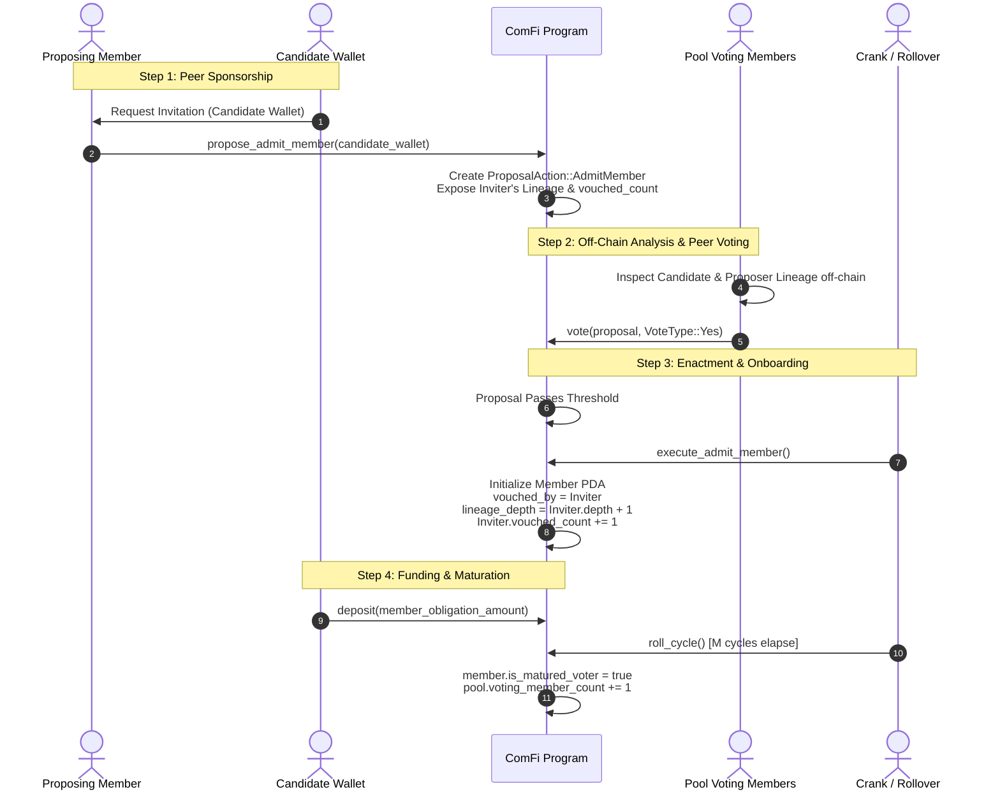

# ADR 0004: Sybil Resistance and Constrained Pool Admission via Lineage-Vouched Governance

## Status
Implemented

## Context and Problem Statement

The ComFi protocol governs collaborative, revolving savings vaults on Solana. Members join pools governed by periodic funding cycles, contributing fixed recurring obligations ([`member_obligation_amount`](file:///c:/Users/sidds/Documents/comfi/programs/comfi/src/pool.rs#L488)), accumulating unconsumed advance prepayments ([`surplus_amount`](file:///c:/Users/sidds/Documents/comfi/programs/comfi/src/pool.rs#L951)), and authorizing shared expenditures via on-chain governance proposals.

In an active pool, proposal approval thresholds ([`Proposal::required_votes_for_pool`](file:///c:/Users/sidds/Documents/comfi/programs/comfi/src/pool.rs#L859-L886)) are calculated dynamically based on the cohort of funded, voting participants in the current cycle:

$$\text{active\_members} = \max(\text{pool.funded\_member\_count}, 1)$$

$$\text{required\_votes} = \left\lceil \frac{\text{active\_members} \times \text{threshold\_bps}}{10{,}000} \right\rceil$$

### The Multi-Wallet Sybil Takeover Attack Vector

Under an unconstrained, permissionless entry model, [`join_pool`](file:///c:/Users/sidds/Documents/comfi/programs/comfi/src/pool.rs#L1002-L1070) allows any valid Solana wallet keypair to enter:
1. **Wallet Proliferation**: An attacker generates $K$ distinct Solana keypairs ($W_1, W_2, \dots, W_K$).
2. **Minimal Capital Infiltration**: The attacker deposits the minimum single-cycle obligation $O = \text{member\_obligation\_amount}$ into the pool from each of the $K$ wallets.
3. **Instant Enfranchisement**: Upon cycle rollover ([`roll_cycle`](file:///c:/Users/sidds/Documents/comfi/programs/comfi/src/pool.rs#L1428-L1485)), every wallet transitions to `is_funded = true`, each receiving strictly $1$ vote in governance.
4. **Majority Seizure**: In a pool with $N$ honest members, an adversary depositing $(N + 1) \times O$ acquires:
   $$\frac{K}{N + K} = \frac{N + 1}{2N + 1} > 50\%$$
   This crosses the simple majority threshold ($\ge 5,001$ bps).
5. **Vault Extraction and Malicious Exploitation**: With an absolute voting majority, the Sybil cartel can pass hostile proposals:
   - Authorizing an exorbitant cycle spend limit ([`ProposalAction::SetSpenderLimit`](file:///c:/Users/sidds/Documents/comfi/programs/comfi/src/pool.rs#L945-L948)) for $W_1$, draining the collective vault.
   - Forcing eviction of honest members ([ADR 0003](file:///c:/Users/sidds/Documents/comfi/programs/comfi/adrs/0003-member-voluntary-exit-and-governance-eviction.md)).
   - Modifying pool configurations ([`ProposalAction::ConfigurationModification`](file:///c:/Users/sidds/Documents/comfi/programs/comfi/src/pool.rs#L952-L962)) to lengthen timelocks, lock out new entrants, or dismantle safeguards.
   - Forcing pool closure ([`ProposalAction::ClosePool`](file:///c:/Users/sidds/Documents/comfi/programs/comfi/src/pool.rs#L963)) after extracting capital.

Because on-chain voting power scales linearly with funded wallet addresses rather than verified unique human identity or tenured community commitment, revolving pools face a severe vulnerability to hostile Sybil takeovers.

To secure revolving pools against governance capture, **joining a pool must be substantially more constrained**. 

---

## Decision Drivers

1. **Constrained Pool Admission Perimeter**:
   Pool entry must not be unconstrained or permissionless by default. Prospective members must be vetted and admitted through a secure protocol barrier before receiving membership or funding status.
2. **Member-Proposed Admission with Peer Governance Vote**:
   Admission must be initiated by an existing pool member proposing to add a candidate wallet. Existing pool members must review and vote to approve the candidate before enrollment.
3. **Off-Chain Identity and Cluster Analysis via Web-of-Trust Lineage**:
   The protocol explicitly rejects hardcoding centralized identity authorities, KYC credentials, or on-chain identity attestations into the smart contract. Centralized attestations create trusted third parties, censorship risks, and fragile oracle dependencies. Instead, identity distinctness and wallet clustering analysis are conducted **off-chain** by client applications, social graph indexers, and community members, utilizing the on-chain lineage graph (`vouched_by`, `lineage_depth`, `vouched_count`) as an immutable data foundation.
4. **Lineage Transparency as an Informed Voting Basis**:
   Every member's vouching lineage (`vouched_by`, parent chain, and number of introduced members) must be permanently recorded on-chain. Transparent lineage provides voters with the critical context needed to identify and reject concentrated Sybil clusters.
5. **Acknowledging Single-Inviter Degradation while Assuming Distributed Vouching**:
   A pool might organically exhibit single-inviter behavior where one member proposes all new entrants and others routinely vote to approve them. While such a pattern might emerge in practice, it severely degrades the pool's Sybil security perimeter. The protocol does not create explicit mechanisms or roles for single-inviters; rather, the security model assumes distributed vouching across members, actively advocates against single-inviter concentration, and provides on-chain lineage tracking so voters can detect and reject it.
6. **Anti-Flash-Join Voting Maturation Schedule**:
   Even after admission approval, newly funded wallets must undergo a probationary maturation schedule before gaining voting rights.
7. **Cycle-Based Timelock and Sovereign Ragequit Protection**:
   Mandatory proposal execution delays must be specified in terms of cycles (`proposal_execution_delay_cycles \ge 1`). Because voluntary member exit ([ADR 0003](file:///c:/Users/sidds/Documents/comfi/programs/comfi/adrs/0003-member-voluntary-exit-and-governance-eviction.md)) refunds surplus immediately but only unlinks members and recalculates quorum on cycle rollover ([`roll_cycle`](file:///c:/Users/sidds/Documents/comfi/programs/comfi/src/pool.rs#L1428)), delaying execution by at least one cycle rollover guarantees that dissenting members can exit cleanly, and any resulting drop below quorum automatically triggers a low-quorum pool lock ([ADR 0002](file:///c:/Users/sidds/Documents/comfi/programs/comfi/adrs/0002-low-quorum-pool-locking.md)) before the proposal can ever execute.

---

## Considered Options

### Option 1: Prohibitive Upfront Capital Staking / Bonding
- **Mechanism**: Every member must deposit an enormous non-refundable bond (e.g. $10\times$ cycle obligation) to join.
- **Drawbacks**: 
  - Highly exclusionary for lower-income participants, contradicting ComFi's core mission of accessible revolving credit.
  - Wealthy adversaries can still comfortably out-capitalize small honest pools.

### Option 2: Mandatory Global Centralized KYC Gatekeeper
- **Mechanism**: Require all users to submit government identification to a centralized KYC vendor before creating or joining any pool.
- **Drawbacks**:
  - Destroys decentralization, pseudonymous privacy, and composability.
  - Introduces substantial regulatory liability, custody risk, and single points of failure.
  - Inflexible for private community savings circles that already possess social trust.

### Option 3: Centralized Identity Attestations / Oracles On-Chain (Rejected)
- **Mechanism**: Require on-chain identity attestations, biometric proof-of-personhood receipts, or third-party oracle attestations (e.g. World ID, centralized identity issuers).
- **Drawbacks**:
  - Replaces decentralized trust with reliance on external authorities, oracle keys, and administrative issuance policies.
  - Introduces censorship vulnerabilities where users can be de-platformed or blacklisted by off-chain identity authorities.
  - Fragile on-chain surface area susceptible to oracle desynchronization or discontinued support.

### Option 4: Open Permissionless Entry with Reactive Eviction
- **Mechanism**: Allow anyone to join freely, relying on governance to evict malicious members post-facto via [ADR 0003](file:///c:/Users/sidds/Documents/comfi/programs/comfi/adrs/0003-member-voluntary-exit-and-governance-eviction.md).
- **Drawbacks**:
  - Flawed timing: once an attacker funds $N+1$ wallets, they already command the voting majority. Honest members can no longer pass an eviction proposal against the attacker's cartel.

### Option 5: Constrained Admission via `InviteVouched` with On-Chain Lineage Tracking, Maturation Delays, and Off-Chain Identity Analysis (Chosen)
- **Mechanism**:
  - **Constrained Entry Gate**: Pool joining is gated. Wallets cannot enter without being proposed by an active member.
  - **Member Vouching & Peer Vote Approval**: An active member submits a proposal to admit a candidate wallet. Existing pool members vote to agree.
  - **Immutable Lineage Tracking**: The candidate's `Member` account records their direct sponsor (`vouched_by`) and increments the sponsor's `vouched_count`. Pool members inspect this lineage tree as an informed basis when voting.
  - **Off-Chain Identity & Cluster Analysis**: Client interfaces, indexers, and community members perform identity distinctness and wallet clustering analysis off-chain to inform peer votes.
  - **Single-Inviter Risk Acknowledged**: The protocol avoids any dedicated single-inviter role or mechanism; if a pool chooses to funnel all additions through one member, its Sybil security foundation breaks down. Lineage tracking makes this pattern transparent so members can advocate against it.
  - **Defense-in-Depth**: Combined with a voting maturation schedule ($M$ cycles before voting), supermajority floors on sensitive actions, and cycle-based timelocked sovereign ragequit.
- **Outcome**: Completely stops automated and Sybil infiltration at the perimeter without centralized oracles, preserves member privacy, and ensures democratic oversight over pool membership.

---

## Detailed Technical Specification

### 1. State Structures & Field Additions

#### A. Pool Account Additions ([`Pool`](file:///c:/Users/sidds/Documents/comfi/programs/comfi/src/pool.rs#L480-L539))

```rust
#[derive(AnchorSerialize, AnchorDeserialize, Clone, Copy, PartialEq, Eq, Debug)]
pub enum AdmissionMode {
    /// Constrained entry: active member proposes candidate, pool members vote to agree.
    /// Tracks on-chain vouching lineage. (Default)
    InviteVouched,
    /// Unrestricted permissionless joining (strictly for local testing or pre-seeded trusted circles).
    Open,
}

pub struct Pool {
    // ... existing fields ...

    /// Admission policy governing how new members join.
    pub admission_mode: AdmissionMode,

    /// Number of consecutive funded cycles a newly admitted member must complete
    /// before acquiring governance proposal creation and voting rights.
    /// Default: 2 cycles. Prevents flash-join Sybil takeovers.
    pub voting_maturation_cycles: u64,

    /// Mandatory execution delay in cycles between proposal approval and execution.
    /// Default: 1 cycle (D >= 1). Guarantees at least one cycle rollover occurs before
    /// any proposal executes, giving leaving members time to resolve departure.
    pub proposal_execution_delay_cycles: u64,

    /// Total number of voting-eligible (matured) funded members in the current cycle.
    pub voting_member_count: u32,

    /// Pending configuration fields for governance updates:
    pub pending_admission_mode: Option<AdmissionMode>,
    pub pending_voting_maturation_cycles: Option<u64>,
    pub pending_proposal_execution_delay_cycles: Option<u64>,
}
```

#### B. Proposal Account Additions ([`Proposal`](file:///c:/Users/sidds/Documents/comfi/programs/comfi/src/pool.rs#L1070-L1082))

```rust
pub struct Proposal {
    // ... existing fields ...

    pub voting_cycle: u64,
    pub deadline_cycle: u64,

    /// Cycle number on or after which this proposal can be executed.
    /// Set upon reaching Executable state: voting_cycle + pool.proposal_execution_delay_cycles.
    pub executable_cycle: u64,

    pub executable_after: i64,
    pub state: ProposalState,
}
```

#### C. Member Account Additions ([`Member`](file:///c:/Users/sidds/Documents/comfi/programs/comfi/src/pool.rs#L939-L965))

```rust
pub struct Member {
    // ... existing fields ...

    /// Direct inviter wallet that vouched for and proposed this member.
    /// Root members of the pool (pool creators/initial cohort) have None.
    pub vouched_by: Option<Pubkey>,

    /// Number of hops from the pool's founding cohort (lineage tree depth).
    pub lineage_depth: u32,

    /// Total number of members this wallet has personally vouched for and added.
    pub vouched_count: u32,

    /// Cycle number on which the member first enrolled in the pool.
    pub joined_cycle: u64,

    /// Number of cumulative cycles this member has been actively funded.
    pub funded_cycle_streak: u64,

    /// True if the member has satisfied the pool's voting maturation requirement.
    pub is_matured_voter: bool,
}
```

#### D. Proposal Action: `AdmitMember` ([`ProposalAction`](file:///c:/Users/sidds/Documents/comfi/programs/comfi/src/pool.rs#L942-L965))

```rust
#[derive(AnchorSerialize, AnchorDeserialize, Clone, PartialEq, Eq, Debug)]
pub enum ProposalAction {
    // ... existing actions: SetSpenderLimit, ConfigurationModification, ClosePool, EvictMember ...

    /// Propose admitting a new wallet to the pool under InviteVouched admission mode.
    AdmitMember {
        /// The prospective member's wallet address.
        candidate_wallet: Pubkey,
        /// The proposing/vouching member's wallet.
        vouched_by: Pubkey,
    },
}
```

#### E. Off-Chain Identity Analysis & Web-of-Trust Lineage

Rather than binding the on-chain program to centralized identity oracles or fragile credential attestations, identity verification is modeled as a **two-tier architecture**:
1. **On-Chain Cryptoeconomic Guarantees**: Immutable lineage tracking (`vouched_by`, `lineage_depth`, `vouched_count`), peer governance votes, anti-flash-join voting maturation, and cycle-delayed sovereign ragequits.
2. **Off-Chain Identity & Cluster Analysis**: Client dApps, community dashboards, and indexers analyze transaction graphs, social graphs, and wallet clustering heuristics to assist members in making informed voting decisions before approving an admission proposal.

---

## Admission Architecture & Governance Workflow



---

## Core Security & Architectural Principles

### 1. `InviteVouched` Admission Flow

In `AdmissionMode::InviteVouched`:
1. **Proposal Initiation**: An active, funded member creates a proposal (`ProposalAction::AdmitMember`). A random external wallet cannot call `join_pool` directly.
2. **Off-Chain Identity Vetting**:
   - Members and community participants inspect the candidate wallet and proposing lineage off-chain (e.g. cluster analysis, social vouches, off-chain attestations).
   - The on-chain contract remains completely permissionless and unburdened by central oracle dependencies.
3. **Lineage Disclosure on Proposal**:
   - The on-chain proposal state directly exposes the proposing member's address, their own `vouched_by` ancestor, and their current `vouched_count`.
   - All pool participants can immediately observe:
     - How many members the proposer has already introduced.
     - The track record and funding status of the proposer's existing lineage.
4. **Peer Voting Agreement**:
   - Active voting members cast votes on the admission proposal.
   - Threshold: Simple majority ($\ge 5,001$ bps) of the current matured voting electorate.
5. **Execution and Enrollment**:
   - Once approved and through any configured timelock, `execute_admit_member` initializes the candidate's `Member` account.
   - The candidate's `vouched_by` is set to the proposing member.
   - The proposer's `vouched_count` is incremented.
   - The candidate can now deposit funds to become funded in the next cycle.

---

### 2. Lineage Tracking as an Informed Basis for Voting

A core insight of this ADR is that **sybil resistance in collaborative credit does not require invasive KYC if social lineage is transparently auditable on-chain**.

- **Lineage Tree**: Every member record contains:
  $$\text{Member.lineage} = (\text{vouched\_by}, \text{lineage\_depth}, \text{vouched\_count})$$
- **Informed Voting Evaluation**:
  When a member proposes adding Wallet $W_{new}$, voters evaluate:
  1. *Who is the sponsor?* Is the sponsor a tenured, consistently funded member with good standing?
  2. *What is the sponsor's vouch count?* Has this sponsor already vouched for 5 other wallets in recent cycles?
  3. *Is the sponsor's tree behaving well?* Have previous members in this lineage defaulted, paused, or caused friction?
- **Spreading Invites Evenly (The Smart Posture)**:
  - Best practice for pool health is for members to distribute new invitations evenly across the cohort (e.g. each member sponsors 1–2 peers).
  - If one member begins proposing a disproportionate number of new wallets, the remaining members observe the concentration immediately in the lineage data and can vote **NO** on the admission proposal.
  - Even without hardcoded algorithmic quotas, transparent lineage gives voters an informed basis to halt Sybil expansion.

---

### 3. Emergent Single-Inviter Concentration and Security Breakdown

In some real-world communities or organizational settings, an operational pattern may emerge where a single member (e.g., a pool creator, employer, or organizer) proposes all new members, while other members passively vote to approve them.

#### The Breakdown of the Security Perimeter
The protocol explicitly acknowledges this risk:
- **Security Degradation**: If a pool adopts single-inviter behavior, its Sybil defense foundation fundamentally breaks down. A single proposer holding a de facto monopoly over introductions can curate a cartel of Sybil wallets over successive cycles, eventually undermining quorum and capturing pool governance.
- **Advocated Against**: The protocol strongly advocates against single-inviter concentration. Collaborative revolving credit is built on decentralized web-of-trust vouching, where invitations, social accountability, and risk are spread across the cohort.

#### Protocol Stance: No Special Privileges & Distributed Assumption
1. **No Explicit Protocol Roles for Single-Inviters**: The protocol intentionally provides no dedicated "single-inviter" account roles, bypass flags, or whitelist mechanics. Every addition must proceed through the same peer-voted `ProposalAction::AdmitMember` flow.
2. **Assumption of Distributed Vouching**: The security model fundamentally assumes that honest pools will distribute invitations across multiple independent members.
3. **Lineage as the Safeguard**: On-chain tracking of `vouched_by` and `vouched_count` ensures that single-inviter concentration cannot occur invisibly. If one wallet begins introducing a disproportionate share of entrants, active voters can immediately observe the clustering in the proposal metadata, challenge the behavior, and vote **NO** to preserve pool decentralization.

---

### 4. Layered Defenses Against Post-Admission Infiltration

Even if a malicious wallet is successfully admitted via `InviteVouched`, downstream protocol layers prevent governance takeover:

#### A. Voting Maturation Schedule (Anti-Flash-Join)
- Admitted members start with `funded_cycle_streak = 0` and `is_matured_voter = false`.
- During [`roll_cycle`](file:///c:/Users/sidds/Documents/comfi/programs/comfi/src/pool.rs#L1428-L1485), as recurring obligations are paid:
  ```rust
  if member.is_funded {
      member.funded_cycle_streak = member.funded_cycle_streak.saturating_add(1);
      if member.funded_cycle_streak >= pool.voting_maturation_cycles {
          if !member.is_matured_voter {
              member.is_matured_voter = true;
              pool.voting_member_count = pool.voting_member_count.saturating_add(1);
          }
      }
  } else {
      member.funded_cycle_streak = 0;
      if member.is_matured_voter {
          member.is_matured_voter = false;
          pool.voting_member_count = pool.voting_member_count.saturating_sub(1);
      }
  }
  ```
- **Threshold Basis**: Governance proposal thresholds are calculated against `pool.voting_member_count`, **not** raw `funded_member_count`:
  $$\text{active\_electorate} = \max(\text{pool.voting\_member\_count}, 1)$$
- New members must fund obligations for $M$ consecutive cycles (e.g. 2–3 cycles) before acquiring voting rights.

#### B. Supermajority Floors for Critical Actions
Critical proposals that redistribute capital or alter membership enforce strict supermajorities:

| Proposal Action | Voting Threshold Floor | Eligible Electorate |
| :--- | :--- | :--- |
| `SetSpenderLimit` | **$66.67\%$ (6,667 bps)** Supermajority | All matured voting members |
| `EvictMember` | **$66.67\%$ (6,667 bps)** Supermajority | Matured voting members **excluding target** |
| `AdmitMember` | **$50.01\%$ (5,001 bps)** Majority | All matured voting members |
| `ConfigurationModification` | **$66.67\%$ (6,667 bps)** Supermajority | All matured voting members |
| `ClosePool` | **$50.01\%$ (5,001 bps)** Majority | All funded members |

#### C. Cycle-Based Timelock (`proposal_execution_delay_cycles`) and Sovereign Ragequit Window

In a cycle-indexed revolving credit protocol, specifying timelocks purely in wall-clock seconds creates an accounting hazard:
- Calling [`leave_pool`](file:///c:/Users/sidds/Documents/comfi/programs/comfi/src/pool.rs#L1072) refunds unconsumed surplus prepayments immediately, but stages member unlinking, funded count decrements, and quorum re-evaluation to occur at cycle rollover ([`roll_cycle`](file:///c:/Users/sidds/Documents/comfi/programs/comfi/src/pool.rs#L1428-L1485)).
- If a proposal were permitted to execute in the *same cycle* it passed (e.g. after a 24-hour delay that expires mid-cycle), an attacker could execute a `SetSpenderLimit` and spend within that active cycle. This spend would sync obligations across members still active for that cycle, causing an accounting race against leaving members.

To solve this, proposal execution is explicitly delayed by **cycles**:

$$\text{proposal.executable\_cycle} = \text{proposal.voting\_cycle} + \text{pool.proposal\_execution\_delay\_cycles} \quad (D \ge 1)$$

```rust
pub fn assert_executable(
    proposal: &Account<Proposal>,
    pool: &Account<Pool>,
) -> Result<()> {
    require!(
        proposal.state == ProposalState::Executable,
        ComfiError::ProposalNotExecutable
    );
    // 1. Mandatory cycle rollover delay (D >= 1)
    require!(
        pool.current_cycle >= proposal.executable_cycle,
        ComfiError::ExecutionCycleNotReached
    );
    // 2. Physical wall-clock timelock floor
    require!(
        Clock::get()?.unix_timestamp >= proposal.executable_after,
        ComfiError::TimelockActive
    );
    Ok(())
}
```

#### How Cycle Delays Guarantee Security:
1. **Forced Rollover Window**: Setting $D \ge 1$ guarantees that at least one cycle rollover (`roll_cycle`) must execute between proposal approval and execution. A proposal approved in Cycle $C$ cannot execute in Cycle $C$.
2. **Clean Member Detachment**: Honest members observe the passed proposal in Cycle $C$ and call `leave_pool`. When `roll_cycle` runs, their status transitions from `Leaving` $\to$ `Exited`, their active count is decremented, and their ties to future pool obligations are completely severed.
3. **Automated Quorum Lock Preempts Execution**: If honest departures drop active participation below `min_quorum_members` or `min_quorum_bps`, `roll_cycle` transitions the pool to `Locked` ([ADR 0002](file:///c:/Users/sidds/Documents/comfi/programs/comfi/adrs/0002-low-quorum-pool-locking.md)). When Cycle $C+D$ arrives and the attacker attempts execution, `pool.ensure_not_locked()?` aborts the transaction. Malicious proposals cannot execute against a locked pool.

---

## Threat Model and Attack Mitigations

| Threat Vector | Adversarial Mechanism | Protocol Mitigation |
| :--- | :--- | :--- |
| **Permissionless Sybil Infiltration** | Attacker spins up 20 wallets and funds them to capture majority. | **Blocked at perimeter**: `AdmissionMode::InviteVouched` requires an existing member to propose and the pool to vote-agree. Direct `join_pool` without an approved proposal is rejected. |
| **Duplicate Identity Under Multiple Wallets** | An existing member attempts to introduce their own alternate wallet. | **Peer Review & Off-Chain Cluster Analysis**: Transparent proposal and lineage history exposes sponsor patterns. Members and client indexers inspect funding patterns and social graphs off-chain, voting **NO** on suspicious duplicate admissions. |
| **Concentrated Inviter Infiltration** | A colluding member proposes a stream of attacker wallets. | **Lineage visibility**: Proposal displays proposer's `vouched_count` and ancestor lineage. Members see the concentration and vote **NO**. |
| **Emergent Single-Inviter Concentration** | Pool members passively allow a single wallet to propose all additions, enabling that wallet to onboard a Sybil cartel. | Lineage tracking exposes proposer concentration (`vouched_count`). Protocol documentation advocates against this pattern. If members still surrender vouching to one actor, security degrades; however, voting maturation ($M$ cycles) and cycle-delayed ragequit still protect existing surplus. |
| **Flash-Funding Takeover** | Attacker gets admitted and deposits massive funds on cycle $C$ to vote on $C+1$. | `voting_maturation_cycles` requires $M$ consecutive funded cycles before `is_matured_voter = true`. Thresholds exclude immature wallets. |
| **Hostile Member Eviction / Fund Drain** | Cartel attempts to evict honest members or set massive spend limits. | $66.67\%$ supermajority required. Target excluded from eviction count. Mandatory `proposal_execution_delay_cycles \ge 1` forces rollover, letting honest members exit with surplus and triggering quorum lock before execution. |

---

## Invariants and Properties

1. **Constrained Admission Invariant**:
   $$\forall w \in \text{Members}, \quad \text{Admitted}(w) \implies (\text{admission\_mode} = \text{Open}) \lor \left(\exists P \in \text{PassedProposals}: P.\text{action} = \texttt{AdmitMember}(w)\right)$$

2. **Lineage Traceability Invariant**:
   $$\forall m \in \text{Members} \setminus \text{FoundingCohort}, \quad m.\text{vouched\_by} \ne \text{None} \land m.\text{lineage\_depth} = \text{Member}(m.\text{vouched\_by}).\text{lineage\_depth} + 1$$

3. **Lineage Monotonicity Invariant**:
   $$\forall m \in \text{Members}, \quad m.\text{vouched\_count} = \sum_{c \in \text{Members}} \mathbb{I}(c.\text{vouched\_by} = m.\text{wallet})$$

4. **Lineage Provenance Invariant**:
   $$\forall m \in \text{Members}, \quad \text{LineageRecord}(m) \text{ is immutable post-admission, ensuring permanent off-chain graph auditability.}$$

5. **Voter Maturation Exclusivity**:
   $$\text{VoterEligibility}(m) \iff (m.\text{is\_funded} = \text{true}) \land (m.\text{funded\_cycle\_streak} \ge \text{pool.voting\_maturation\_cycles}) \land (m.\text{status} = \text{Active})$$

6. **Cycle-Delayed Execution Invariant**:
   $$\forall P \in \text{Proposals}, \quad \text{Executable}(P) \implies (P.\text{executable\_cycle} \ge P.\text{voting\_cycle} + 1) \land (\text{pool.current\_cycle} \ge P.\text{executable\_cycle})$$

7. **Sovereign Ragequit Separation Invariant**:
   $$\forall m \in \text{LeavingMembers}(\text{cycle } C), \quad \text{Status}(m, \text{cycle } C+1) = \text{Exited} \land (C+1 \le P.\text{executable\_cycle})$$

---

## Consequences

### Positive
- **Guaranteed Perimeter Security**: Eliminates permissionless multi-wallet infiltration without relying on invasive or centralized KYC.
- **Informed Governance Context**: Lineage transparency empowers pool members to make informed voting decisions based on community relationships and inviter accountability.
- **Transparent Social Accountability**: Supports decentralized mutual-credit groups with distributed vouching while exposing concentration risks on-chain so pools can preserve decentralization.
- **Graceful Failure Modes**: Even if an unauthorized wallet slips past admission, voting maturation, supermajority floors, and timelocked ragequits prevent capital loss.

### Negative / Trade-offs
- **Onboarding Latency**: Prospective members cannot join instantaneously; they must be proposed and wait for an admission voting window.
- **Account State Size**: Slight increase in `Member` account byte layout to store `vouched_by`, `lineage_depth`, and `vouched_count`.
- **Governance Overhead**: Existing members must actively participate in voting on admission proposals for new entrants.

---

## Implementation References

- Member data structure and lineage tracking: [`Member`](file:///c:/Users/sidds/Documents/comfi/programs/comfi/src/pool.rs#L939-L965)
- Pool configuration and admission modes: [`Pool`](file:///c:/Users/sidds/Documents/comfi/programs/comfi/src/pool.rs#L480-L539)
- Governance proposal definitions and execution: [`ProposalAction`](file:///c:/Users/sidds/Documents/comfi/programs/comfi/src/pool.rs#L942-L965)
- Voting threshold calculations: [`Proposal::required_votes_for_pool`](file:///c:/Users/sidds/Documents/comfi/programs/comfi/src/pool.rs#L859-L886)
- Rollover cycle linked-list traversal: [`process_cycle_members`](file:///c:/Users/sidds/Documents/comfi/programs/comfi/src/pool.rs#L1318-L1426)
- Fair Closure reference: [ADR 0001: Fair Closure Algorithm](file:///c:/Users/sidds/Documents/comfi/programs/comfi/adrs/0001-fair-closure-algorithm.md)
- Low Quorum locking reference: [ADR 0002: Low Quorum Pool Locking and Auto-Closure](file:///c:/Users/sidds/Documents/comfi/programs/comfi/adrs/0002-low-quorum-pool-locking.md)
- Member voluntary exit and eviction reference: [ADR 0003: Member Voluntary Exit, Governance Eviction, and Inviolable Surplus Preservation](file:///c:/Users/sidds/Documents/comfi/programs/comfi/adrs/0003-member-voluntary-exit-and-governance-eviction.md)
