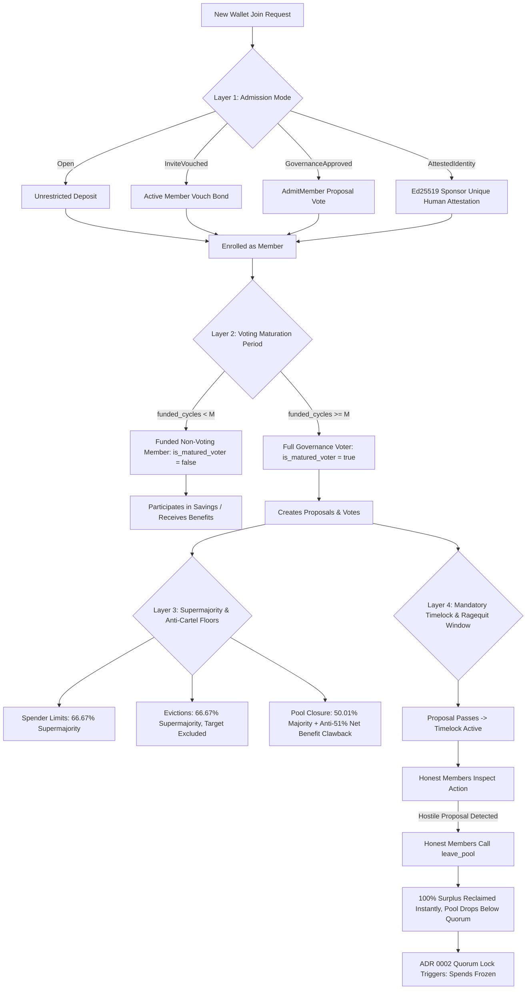

# ADR 0004: Sybil Resistance and Multi-Wallet Takeover Defense

## Status
Proposed

## Context and Problem Statement

The ComFi protocol governs collaborative, revolving savings vaults on Solana. Members join pools governed by periodic funding cycles, contributing fixed recurring obligations ([`member_obligation_amount`](file:///c:/Users/sidds/Documents/comfi/programs/comfi/src/pool.rs#L488)), accumulating unconsumed advance prepayments ([`surplus_amount`](file:///c:/Users/sidds/Documents/comfi/programs/comfi/src/pool.rs#L728)), and authorizing shared expenditures via on-chain governance proposals.

In an active pool, proposal approval thresholds ([`Proposal::required_votes_for_pool`](file:///c:/Users/sidds/Documents/comfi/programs/comfi/src/pool.rs#L859-L886)) are calculated dynamically based on the cohort of funded, voting participants in the current cycle:

$$\text{active\_members} = \max(\text{pool.funded\_member\_count}, 1)$$

$$\text{required\_votes} = \left\lceil \frac{\text{active\_members} \times \text{threshold\_bps}}{10{,}000} \right\rceil$$

### The Multi-Wallet Sybil Takeover Attack Vector

Under the baseline protocol implementation, [`join_pool`](file:///c:/Users/sidds/Documents/comfi/programs/comfi/src/pool.rs#L1002-L1070) is open and permissionless to any valid Solana wallet keypair:
1. **Wallet Proliferation**: An attacker generates $K$ distinct Solana keypairs ($W_1, W_2, \dots, W_K$).
2. **Minimal Capital Infiltration**: The attacker deposits the minimum single-cycle obligation $O = \text{member\_obligation\_amount}$ into the pool from each of the $K$ wallets.
3. **Instant Enfranchisement**: Upon the subsequent cycle rollover ([`roll_cycle`](file:///c:/Users/sidds/Documents/comfi/programs/comfi/src/pool.rs#L1428-L1485)), every wallet transitions to `is_funded = true`, each receiving strictly $1$ vote in governance.
4. **Majority Seizure**: In a pool with $N$ honest members, an adversary depositing $(N + 1) \times O$ acquires:
   $$\frac{K}{N + K} = \frac{N + 1}{2N + 1} > 50\%$$
   This crosses the simple majority threshold ($\ge 5,001$ bps).
5. **Vault Extraction and Malicious Exploitation**: With an absolute voting majority, the Sybil cartel can pass hostile proposals:
   - Authorizing an exorbitant cycle spend limit ([`ProposalAction::SetSpenderLimit`](file:///c:/Users/sidds/Documents/comfi/programs/comfi/src/pool.rs#L945-L948)) for $W_1$, draining the collective vault.
   - Forcing eviction of honest members ([ADR 0003](file:///c:/Users/sidds/Documents/comfi/programs/comfi/adrs/0003-member-voluntary-exit-and-governance-eviction.md)).
   - Modifying pool configurations ([`ProposalAction::ConfigurationModification`](file:///c:/Users/sidds/Documents/comfi/programs/comfi/src/pool.rs#L952-L962)) to lengthen timelocks, lock out new entrants, or dismantle safeguards.
   - Forcing pool closure ([`ProposalAction::ClosePool`](file:///c:/Users/sidds/Documents/comfi/programs/comfi/src/pool.rs#L963)) after extracting capital.

Because on-chain voting power scales linearly with funded wallet addresses rather than verified unique human identity or tenured community commitment, revolving pools face a severe vulnerability to hostile Sybil takeovers.

---

## Decision Drivers

1. **Anti-Sybil Perimeter Security**:
   Pools must have the ability to restrict admission based on verified unique human identity, community vouchers, or governance approval without forcing global centralized KYC.
2. **Anti-Flash-Join Voting Defense (Temporal Maturation)**:
   Newly admitted wallets must not acquire voting power on the very next cycle rollover. A maturation/probation schedule must delay voting rights, preventing flash-funding hostile takeovers.
3. **Preservation of Pseudonymous Privacy**:
   Identity verification must not compromise user privacy or expose real-world identity on-chain; it must leverage zero-knowledge proofs, decentralized identity credentials, or opaque sponsor quote attestations.
4. **Economic and Game-Theoretic Disincentives**:
   Hostile takeovers must be economically irrational. Attackers must risk capital lockup while honest members possess an escape hatch to exit unharmed.
5. **Configurability Across Diverse Pool Use-Cases**:
   Different pools have different trust assumptions (e.g. private family savings circles vs. semi-public mutual credit DAOs). The protocol must offer flexible admission policies suited to each use-case.
6. **Timelocked Ragequit Protection**:
   Mandatory timelocks combined with voluntary exit ([ADR 0003](file:///c:/Users/sidds/Documents/comfi/programs/comfi/adrs/0003-member-voluntary-exit-and-governance-eviction.md)) must guarantee that honest members can withdraw 100% of their surplus prepayments before any contested proposal executes.

---

## Considered Options

### Option 1: Prohibitive Upfront Capital Staking / Bonding
- **Mechanism**: Every member must deposit an enormous non-refundable bond (e.g. $10\times$ cycle obligation) to join.
- **Drawbacks**: 
  - Highly exclusionary for lower-income participants, contradicting ComFi's core mission of accessible revolving savings.
  - Wealthy adversaries can still comfortably out-capitalize small honest pools.

### Option 2: Mandatory Global KYC Gatekeeper
- **Mechanism**: Require all users to submit government identification to a centralized gatekeeper before creating or joining any pool.
- **Drawbacks**:
  - Destroys decentralization, pseudonymous privacy, and composability.
  - Introduces substantial regulatory liability and single points of failure.

### Option 3: Layered Defense-in-Depth Architecture (Chosen)
- **Mechanism**:
  - **Layer 1: Configurable Admission Modes**: Pools declare admission policies at creation (`Open`, `InviteVouched`, `GovernanceApproved`, `AttestedIdentity`).
  - **Layer 2: Cryptographic Identity Attestation**: For public pools (`AttestedIdentity`), require an Ed25519 sponsor attestation of unique human identity (e.g. Civic Pass, WorldID, or device biometric key), enforcing strictly **1 wallet per unique human per pool** via an on-chain `IdentityReceipt` PDA.
  - **Layer 3: Voting Power Maturation Schedule**: Newly joined members must complete $M$ consecutive funded cycles before acquiring voting rights (`is_matured_voter = true`). Voting thresholds are calculated strictly over matured members.
  - **Layer 4: Supermajority Floors**: Critical proposals (`SetSpenderLimit`, `EvictMember`, `ConfigurationModification`) require a strict $66.67\%$ (6,667 bps) supermajority.
  - **Layer 5: Timelocked Sovereign Ragequit**: Mandatory timelocks allow honest members to invoke `leave_pool` ([ADR 0003](file:///c:/Users/sidds/Documents/comfi/programs/comfi/adrs/0003-member-voluntary-exit-and-governance-eviction.md)) with 100% surplus before execution, dropping participation below quorum and triggering an automated pool lock ([ADR 0002](file:///c:/Users/sidds/Documents/comfi/programs/comfi/adrs/0002-low-quorum-pool-locking.md)).
- **Outcome**: Completely neutralizes multi-wallet takeovers across economic, temporal, cryptographic, and game-theoretic attack vectors.

---

## Detailed Technical Specification

### 1. State Structures & Field Additions

#### A. Pool Account Additions ([`Pool`](file:///c:/Users/sidds/Documents/comfi/programs/comfi/src/pool.rs#L480-L539))

```rust
#[derive(AnchorSerialize, AnchorDeserialize, Clone, Copy, PartialEq, Eq, Debug)]
pub enum AdmissionMode {
    /// Anyone can join permissionlessly (default for testing/private trusted circles).
    Open,
    /// Must be vouched by an existing funded member who stakes a voucher bond.
    InviteVouched,
    /// Admission requires a passed governance proposal (AdmitMember).
    GovernanceApproved,
    /// Requires an Ed25519 sponsor attestation of unique human identity (1 human = 1 wallet per pool).
    AttestedIdentity,
}

pub struct Pool {
    // ... existing fields ...

    /// Admission policy governing how new members join.
    pub admission_mode: AdmissionMode,

    /// Number of consecutive funded cycles a newly admitted member must complete
    /// before acquiring governance proposal creation and voting rights.
    /// Default: 2 cycles. Prevents flash-join Sybil takeovers.
    pub voting_maturation_cycles: u64,

    /// Total number of voting-eligible (matured) funded members in the current cycle.
    pub voting_member_count: u32,

    /// Pending configuration fields for governance updates:
    pub pending_voting_maturation_cycles: u64,
}
```

#### B. Member Account Additions ([`Member`](file:///c:/Users/sidds/Documents/comfi/programs/comfi/src/pool.rs#L715-L740))

```rust
pub struct Member {
    // ... existing fields ...

    /// Cycle number on which the member first achieved funded status.
    pub joined_cycle: u64,

    /// Number of cumulative cycles this member has been actively funded.
    pub funded_cycle_streak: u64,

    /// True if the member has satisfied the pool's voting maturation requirement.
    pub is_matured_voter: bool,

    /// Optional voucher address that endorsed this member (for InviteVouched mode).
    pub vouched_by: Option<Pubkey>,
}
```

#### C. Identity Receipt PDA (Unique Human Enforcement)

For pools operating under `AdmissionMode::AttestedIdentity`, uniqueness is enforced on-chain via a dedicated PDA:

```rust
/// PDA seeds: ["identity", pool.key().as_ref(), identity_commitment.as_ref()]
#[account]
pub struct IdentityReceipt {
    pub pool: Pubkey,
    pub member: Pubkey,
    pub identity_commitment: [u8; 32],
    pub bump: u8,
}

impl IdentityReceipt {
    pub const SPACE: usize = 8 + 32 + 32 + 32 + 1;
}
```

---

### 2. Multi-Layer Defense Architecture



---

### 3. Layer 1: Configurable Admission Modes

When creating a pool ([`CreatePoolArgs`](file:///c:/Users/sidds/Documents/comfi/programs/comfi/src/deployer.rs#L25-L46)), the creator selects the admission policy:

#### A. Mode 1: `AdmissionMode::AttestedIdentity` (Decentralized Identity Verification)
- Uses the existing ComFi off-chain quote verification architecture (`verify_preceding_ed25519_quote` with `GlobalConfig.quote_authority`).
- The sponsor API verifies a unique decentralized identity credential (e.g. Civic Pass, WorldID, Solana Mobile Stack hardware key, or phone-bound passkey).
- The sponsor issues an Ed25519 signed message:
  ```rust
  pub struct SponsorJoinQuote {
      pub quote_id: [u8; 32],
      pub pool: Pubkey,
      pub candidate_wallet: Pubkey,
      pub identity_commitment: [u8; 32], // Hash of unique human credential
      pub expires_at: i64,
  }
  ```
- An on-chain PDA `IdentityReceipt` (`seeds = ["identity", pool, identity_commitment]`) is initialized on join. If the same physical identity attempts to join with a secondary wallet, the PDA initialization fails with `AccountAlreadyInitialized`.
- **Result**: Exactly 1 wallet per unique human per pool. Sybil wallet proliferation is impossible.

#### B. Mode 2: `AdmissionMode::InviteVouched` (Web-of-Trust / Mutual Credit)
- A prospective member can join only if accompanied by an `inviter: Signer` who is an active funded member of the pool.
- The inviter stakes a temporary voucher bond ($B = \text{member\_obligation\_amount}$). If the vouched member defaults or is evicted for malicious behavior, the bond is forfeited to pool conferred capital.
- Each active member has a limited invitation quota (e.g. 1 active invite per cycle).
- **Result**: An attacker cannot generate wallets out of thin air; they must convince existing members to stake real capital on each wallet.

#### C. Mode 3: `AdmissionMode::GovernanceApproved` (Club / DAO Mode)
- Calling `join_pool` creates a `JoinPoolRequest` account and escrows the initial deposit.
- Existing members vote on a `ProposalAction::AdmitMember { candidate_wallet }`.
- Only once the proposal passes and completes timelock can the candidate be enrolled as an active member.
- **Result**: Sybil takeovers are blocked at the perimeter by community vetting.

#### D. Mode 4: `AdmissionMode::Open`
- Permissionless joining for development, testing, or private family pools where all participants know each other off-chain.

---

### 4. Layer 2: Voting Power Maturation Schedule (Anti-Flash-Join Period)

Even if an attacker bypasses admission (or in `Open` pools), they **cannot immediately vote**:

- When a member joins, their `joined_cycle = pool.current_cycle` and `funded_cycle_streak = 0`.
- During [`roll_cycle`](file:///c:/Users/sidds/Documents/comfi/programs/comfi/src/pool.rs#L1428-L1485), as obligations are consumed:
  ```rust
  if member.is_funded {
      member.funded_cycle_streak = member.funded_cycle_streak.saturating_add(1);
      if member.funded_cycle_streak >= pool.voting_maturation_cycles {
          if !member.is_matured_voter {
              member.is_matured_voter = true;
              pool.voting_member_count = pool.voting_member_count.saturating_add(1);
          }
      }
  } else {
      member.funded_cycle_streak = 0;
      if member.is_matured_voter {
          member.is_matured_voter = false;
          pool.voting_member_count = pool.voting_member_count.saturating_sub(1);
      }
  }
  ```
- **Maturation Requirement**: A member can create proposals or cast votes (`create_proposal`, `vote`) **only if** `member.is_matured_voter == true`.
- **Electorate Basis**: Proposal thresholds are calculated against `pool.voting_member_count`, **not** raw `funded_member_count`:
  $$\text{active\_electorate} = \max(\text{pool.voting\_member\_count}, 1)$$
- **Security Consequence**:
  An attacker cannot deposit funds at cycle $C$ and vote at cycle $C+1$. They must deposit and sustain obligations over $M$ cycles (e.g. 2–3 full cycles). Over this multi-week window, honest members observe the influx of unknown funded wallets, can inspect their behavior, freeze spending via quorum locks, or invoke their ragequit rights.

---

### 5. Layer 3: Supermajority Floors for Hostile Actions

Simple $50.01\%$ majorities are insufficient for actions that redistribute wealth or alter membership:

| Proposal Action | Voting Threshold Floor | Eligible Electorate |
| :--- | :--- | :--- |
| `SetSpenderLimit` | **$66.67\%$ (6,667 bps)** Supermajority | All matured voting members |
| `EvictMember` | **$66.67\%$ (6,667 bps)** Supermajority | Matured voting members **excluding target** |
| `AdmitMember` | **$50.01\%$ (5,001 bps)** Majority | All matured voting members |
| `ConfigurationModification` | **$66.67\%$ (6,667 bps)** Supermajority | All matured voting members |
| `ClosePool` | **$50.01\%$ (5,001 bps)** Majority | All funded members (or contributors if zero funded) |

By elevating `SetSpenderLimit` and `EvictMember` to a $2/3$ supermajority, an attacker needs double the votes of honest participants, making Sybil attacks economically unviable.

---

### 6. Layer 4: Timelocked Sovereign Ragequit

All proposals in ComFi must observe `pool.timelock_seconds` between finalization (`ProposalState::Executable`) and execution (`execute_*`).

- If an attacker somehow achieves supermajority and passes a malicious `SetSpenderLimit` or `EvictMember` proposal:
  1. The proposal enters the mandatory timelock window (e.g. 48–72 hours).
  2. The proposal state is publicly visible as `Executable` with timestamp `executable_after`.
  3. Any honest member can immediately call `leave_pool` ([ADR 0003](file:///c:/Users/sidds/Documents/comfi/programs/comfi/adrs/0003-member-voluntary-exit-and-governance-eviction.md)).
  4. The exiting member withdraws 100% of their unconsumed surplus prepayments directly to their wallet.
  5. If multiple honest members exit, the vault balance drops, and the pool drops below `min_quorum_members` or `min_quorum_bps`.
  6. Upon next rollover, the pool automatically locks ([ADR 0002](file:///c:/Users/sidds/Documents/comfi/programs/comfi/adrs/0002-low-quorum-pool-locking.md)), blocking the execution of all non-closure proposals!
- **Game-Theoretic Result**: An attacker who attempts a hostile spend ends up locking their own capital into a frozen vault, while honest participants walk away with all their surplus intact.

---

## Threat Model and Attack Mitigations

| Threat Vector | Adversarial Mechanism | Protocol Mitigation |
| :--- | :--- | :--- |
| **Flash Multi-Wallet Funding Takeover** | Attacker creates 10 wallets, funds 1 cycle each, and attempts to pass malicious spend limits on next cycle roll. | **1.** `AttestedIdentity` / `InviteVouched` gates admission.<br>**2.** `voting_maturation_cycles` delays voting rights by $M$ cycles.<br>**3.** $66.67\%$ supermajority required for spend limits.<br>**4.** Timelocked ragequit lets honest members exit with surplus before execution. |
| **Sybil Flooding to Brick Quorum** | Attacker floods pool with unpaused accounts to inflate `member_count` and cause quorum lock failure. | `min_quorum_bps` is evaluated against enrolled members, but `member_cap` limits total pool size, and admission modes (`InviteVouched`/`AttestedIdentity`) prevent unauthorized account creation. |
| **Fake Identity Spoofing** | Attacker attempts to reuse identity proofs across multiple wallets. | On-chain `IdentityReceipt` PDA derivation (`seeds = ["identity", pool, identity_commitment]`) rejects duplicate commitments atomically. |
| **Bribing Existing Voters** | Attacker purchases voting power from established matured members. | Mandatory timelock ensures honest non-colluding members can always ragequit before malicious spending occurs. |

---

## Invariants and Properties

1. **Unique Physical Identity Invariant**:
   $$\text{In AttestedIdentity mode}, \quad \forall w_1 \ne w_2 \in \text{Wallets}, \quad \text{Identity}(w_1) \ne \text{Identity}(w_2)$$

2. **Voting Power Exclusivity**:
   $$\text{VoterEligibility}(m) \iff (m.\text{is\_funded} = \text{true}) \land (m.\text{funded\_cycle\_streak} \ge \text{pool.voting\_maturation\_cycles}) \land (m.\text{status} = \text{Active})$$

3. **Electorate Integrity**:
   $$\text{pool.voting\_member\_count} = \sum_{m} \mathbb{I}(\text{VoterEligibility}(m))$$

4. **Timelock Sovereign Exit Right**:
   $$\text{For any proposal } P \text{ in state } \texttt{Executable}, \quad \forall t < P.\text{executable\_after}, \quad \texttt{leave\_pool} \text{ is unconditionally permitted.}$$

---

## Consequences

### Positive
- **Complete Elimination of Sybil Takeovers**: Public pools can safely operate on Solana without risking multi-wallet governance capture.
- **Flexible Community Gating**: Accommodates diverse organizational structures (open testbeds, private circles, mutual credit DAOs).
- **Protection for Honest Capital**: Combines identity verification, voting maturation, supermajorities, and timelocked ragequits into an impenetrable security boundary.

### Negative / Trade-offs
- **Onboarding Friction in Attested Pools**: Members joining `AttestedIdentity` pools must obtain an off-chain sponsor quote or pass decentralized identity verification.
- **Voting Latency**: Newly funded members must wait $M$ cycles before participating in governance votes, slightly delaying initial governance involvement.

---

## Implementation References

- Member data structure and maturation tracking: [`Member`](file:///c:/Users/sidds/Documents/comfi/programs/comfi/src/pool.rs#L715-L804)
- Pool governance and proposal threshold calculations: [`Proposal::required_votes_for_pool`](file:///c:/Users/sidds/Documents/comfi/programs/comfi/src/pool.rs#L859-L886)
- Cycle rollover and linked list traversal: [`process_cycle_members`](file:///c:/Users/sidds/Documents/comfi/programs/comfi/src/pool.rs#L1318-L1426)
- Pool creation arguments and validation: [`CreatePoolArgs`](file:///c:/Users/sidds/Documents/comfi/programs/comfi/src/deployer.rs#L25-L46)
- Sponsor Ed25519 signature verification: [`verify_preceding_ed25519_quote`](file:///c:/Users/sidds/Documents/comfi/programs/comfi/src/pool.rs#L38-L98)
- Fair Closure liquidation reference: [ADR 0001: Fair Closure Algorithm](file:///c:/Users/sidds/Documents/comfi/programs/comfi/adrs/0001-fair-closure-algorithm.md)
- Low Quorum locking reference: [ADR 0002: Low Quorum Pool Locking and Auto-Closure](file:///c:/Users/sidds/Documents/comfi/programs/comfi/adrs/0002-low-quorum-pool-locking.md)
- Member exit and eviction reference: [ADR 0003: Member Voluntary Exit, Governance Eviction, and Inviolable Surplus Preservation](file:///c:/Users/sidds/Documents/comfi/programs/comfi/adrs/0003-member-voluntary-exit-and-governance-eviction.md)
