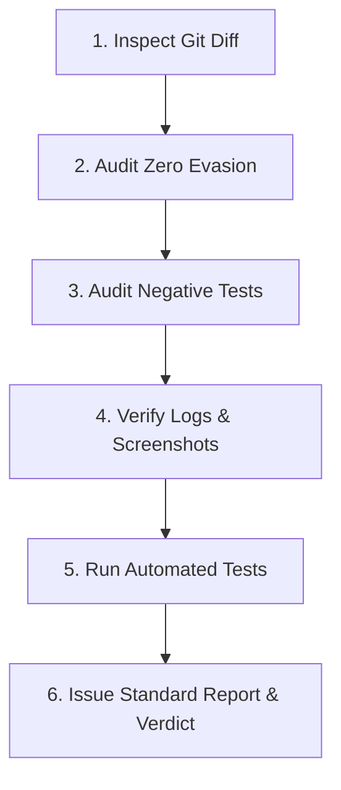

# ComFi Code Review Skill

This skill defines the protocol for conducting **independent, unbiased code reviews** using a read-only subagent before final completion commits (Commit 2) in the ComFi repository.

---

## 1. Core Review Invariants

1. **Unbiased Review (Minimal Context Injection)**:
   The calling agent must provide **minimal, objective context** to the reviewer subagent. The caller must **never** explain its reasoning, defend trade-offs, rationalize shortcuts, or summarize what it intended to do. The reviewer must evaluate the implementation purely against the task requirements, diff, and objective evidence.
2. **Objective Verification Artifacts**:
   The caller may supply raw, objective verification artifacts:
   - **Verification Logs**: Raw execution outputs from test runners (`npm test`), type checks (`npm run typecheck`), or localnet action simulators.
   - **Screenshots / Visual Artifacts**: UI screenshots or recordings demonstrating visual fidelity, responsive layouts, or wallet/modal states.
   These artifacts provide factual verification without introducing author rationalization or bias.
3. **Strictly Read-Only Reviewer**:
   The reviewer subagent operates in a purely read-only capacity. It must **never** edit files, run mutating git commands (`git add`, `git commit`, `git checkout`, `git stash`), or alter repo state. It only inspects files, evaluates verification artifacts, runs automated checks, and outputs an evaluation report.
4. **Pre-Commit Enforcement Gate**:
   Code review must take place before creating Commit 2 (`- [x] [Completed: ...]`). No task may be marked completed in `TASKLIST.md` until the reviewer returns an `APPROVED` verdict.
5. **Mandatory Invariant Verification**:
   - **Zero Failure Evasion**: Strictly verify no `try-catch` blocks were added to evade or swallow legitimate failures. Any invalid input or invariant violation must escalate immediately.
   - **Negative & Escalation Tests**: Any new or modified public functions/APIs must have explicit negative tests asserting rejection on invalid parameters.
   - **Verification Pass**: All unit tests (`npm test`) and type checks (`npm run typecheck`) must pass with 0 errors.

---

## 2. Caller Workflow: Requesting a Review

When the author subagent has finished implementing changes, running tests, and capturing verification artifacts, it invokes a reviewer subagent following these constraints:

### A. Allowed vs. Prohibited Context
- **Allowed Context**:
  - The exact task item verbatim from [`TASKLIST.md`](../../TASKLIST.md).
  - The git diff target or commit range (e.g. `git diff HEAD~1` or uncommitted working tree diff against base).
  - Verification logs (raw test output, simulator results).
  - Verification screenshots / media file paths (for UI/web changes).
  - Repository invariants checklist.
- **Prohibited Context**:
  - Summaries explaining "what I did" or "how I implemented this".
  - Explanations of why certain edge cases were skipped or deferred.
  - Justifications for architectural or design decisions.
  - Subjective commentary nudging the reviewer toward approval.

### B. Standard Reviewer Subagent Prompt Template
The caller must use this standardized prompt template to invoke the reviewer:

```text
You are an independent, read-only code reviewer for the ComFi codebase.
Your goal is to inspect the current changes and provide an unbiased review verdict before the final completion commit.
Follow the standard reviewer instructions in skills/comfi-code-review/SKILL.md.

Constraints:
1. You are strictly READ-ONLY. Do NOT edit, delete, or commit any files.
2. Evaluate strictly against repository invariants and provided verification artifacts.
3. Run independent verification: `npm test` and `npm run typecheck`.

Task under review:
[Insert verbatim task line from TASKLIST.md]

Diff to inspect:
Inspect uncommitted changes (`git diff` and `git status`) or diff against claim commit (`git diff HEAD~1`).

Verification Logs (if applicable):
[Insert raw stdout/stderr logs from npm test / typecheck / simulator, or path to log file]

Verification Screenshots / Media Paths (if applicable):
[Insert absolute file paths to captured UI screenshots, e.g. .gemini/.../screenshot.png]

Repository Invariants:
- Zero failure evasion: No try-catch blocks suppressing genuine errors; escalate on invalid parameters.
- Tests pass: Unit tests and type checks must pass with zero failures.
- Negative tests: Negative/escalation tests exist for newly introduced inputs.
- Visual correctness: If UI changes were made, verify screenshots match design standards.

Provide your review report following the standard schema in skills/comfi-code-review/SKILL.md.
```

---

## 3. Reviewer Standard Operating Procedure (SOP)

To eliminate variance between reviewer subagents, the reviewer **must execute this exact 6-step checklist in order**:



### Step 1: Inspect Scope and Git Diff
1. Check working directory status and list modified files:
   ```bash
   git status --short
   ```
2. Inspect the full diff:
   ```bash
   git diff
   ```
   *(Or `git diff HEAD~1` if Commit 1 is already in local git history).*
3. Verify that changes are confined strictly to files relevant to the task.

### Step 2: Zero Failure Evasion Audit
1. Search modified files for `catch` blocks or error suppression:
   ```bash
   git diff -U0 | grep -E "catch|\.catch|try \{"
   ```
2. Audit each occurrence:
   - Does any `catch` swallow an error, return `null`/`undefined`, or log without re-throwing? **FAIL (BLOCKER)**.
   - Do input validation checks throw/reject with descriptive error messages when arguments violate contract assumptions? If missing: **FAIL (BLOCKER)**.

### Step 3: Audit Negative Test Coverage
1. Identify all newly introduced or modified public functions, API endpoints, or action handlers.
2. Inspect test files (`test/**/*.test.ts` or `test/**/*.test.js`) to confirm negative tests exist:
   - Must assert `assert.throws()` or `assert.rejects()` on invalid parameters, missing addresses, or malformed inputs.
   - If negative tests are omitted for new entrypoints: **FAIL (BLOCKER)**.

### Step 4: Verify Provided Logs & Screenshots
1. **Verification Logs**:
   - Check caller-supplied logs to confirm test suites executed cleanly without skipped tests or unhandled promise warnings.
   - Cross-check log timestamps or test counters against the actual suite size.
2. **Visual Screenshots** (for UI/Web changes):
   - View provided image paths using file viewing tools.
   - Verify alignment, contrast, typography, component states (e.g. connected vs disconnected wallet, modal overlays, empty states).
   - Flag any visual defects, broken elements, or unstyled controls: **FAIL (BLOCKER)**.

### Step 5: Run Independent Automated Verification
Run automated tests and type checks directly to independently verify repo health:
```bash
npm test
npm run typecheck
```
Both commands must exit with code 0. Any failure or TypeScript compiler error is an automatic **BLOCKER**.

### Step 6: Apply Decision Rubric & Output Report
Apply the standard rubric to determine findings and final verdict:

| Severity | Criteria | Impact on Verdict |
| :--- | :--- | :--- |
| **`BLOCKER`** | Try-catch error suppression, missing negative test cases, test/typecheck failures, broken UI in screenshot, unhandled contract errors, exposed secrets. | Requires **`VERDICT: CHANGES_REQUESTED`** |
| **`WARNING`** | Missing JSDoc/comments on complex logic, loose typing (`any`), non-fatal performance concern, minor UI padding/spacing inconsistency. | 3+ warnings trigger **`CHANGES_REQUESTED`**; otherwise can approve with notes. |
| **`NOTE`** | Minor suggestions, code style preferences that conform to repository standards. | Informational only; does not block **`APPROVED`**. |

---

## 4. Standard Review Report Schema

Every reviewer subagent must format its output strictly adhering to this Markdown template:

```markdown
## Code Review Report

### 1. Diff Inspection & Scope
- **Modified Files**: `[List of files touched]`
- **Task Alignment**: [Confirms changes directly address the task item]

### 2. Invariant Checklist
- [x] **Zero Failure Evasion**: No suppressing try-catch blocks observed.
- [x] **Negative Test Coverage**: Explicit assertions exist for invalid inputs.
- [x] **Verification Logs & Screenshots**: Provided logs and screenshots verified.
- [x] **Independent Tests**: `npm test` passed (0 failures).
- [x] **Type Check**: `npm run typecheck` passed (0 errors).

### 3. Verification Evidence Review
- **Logs Evaluation**: [Summary of log review, test counts, execution health]
- **Screenshot / UI Evaluation**: [Summary of visual verification, or 'N/A for non-UI task']

### 4. Findings & Observations
- **[BLOCKER]** `apps/web/src/wallet.tsx:L120`: Missing parameter escalation check when keypair is null.
- **[WARNING]** `apps/web/src/WalletModal.tsx:L45`: Add explicit aria-label to close button.
- **[NOTE]** `services/sponsor-api/src/index.ts:L15`: Clean typing on configuration object.

### 5. Final Verdict
VERDICT: [APPROVED | CHANGES_REQUESTED]
```

---

## 5. Handling Review Verdicts

### When `VERDICT: APPROVED`
The author subagent may proceed immediately to **Commit 2**:
1. Update `TASKLIST.md` to mark the task completed: `- [x] [Completed: <agent_name>] ...`
2. Commit modified files and push Commit 2.
3. Terminate session per the task management protocol.

### When `VERDICT: CHANGES_REQUESTED`
1. The author subagent must fix all `BLOCKER` and qualifying `WARNING` items identified by the reviewer.
2. Run `npm test` and `npm run typecheck` after applying fixes.
3. Update verification logs and capture fresh screenshots if UI was modified.
4. Re-request code review with the updated evidence until `APPROVED` is achieved.
5. Do NOT attempt to push Commit 2 while unresolved blockers remain.
